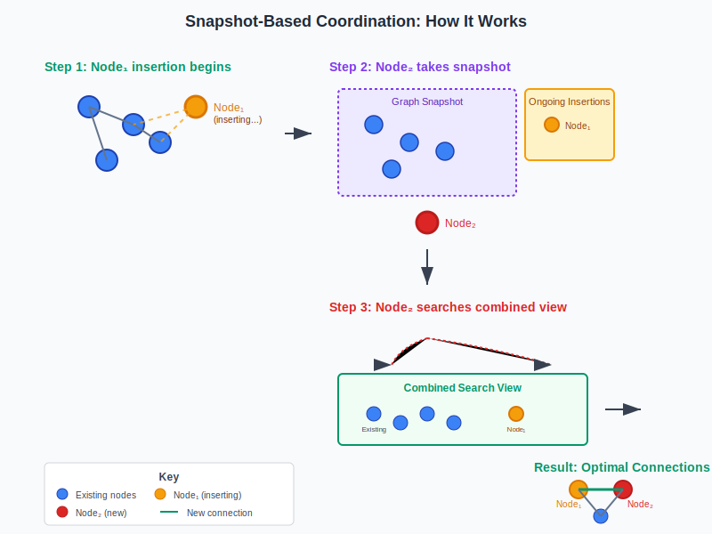

# Breaking the Single-Thread Bottleneck: Concurrent Vector Graph Construction in OpenSearch

*How DataStax and the OpenSearch community achieved near-linear scalability for vector index construction through lock-free concurrent graph building*

Vector search has become the backbone of modern AI applications, from semantic search to RAG (Retrieval Augmented Generation) systems. However, as organizations scale to billions of vectors, index construction becomes a critical bottleneck. Traditional graph-based vector indices like HNSW (Hierarchical Navigable Small World) have been limited to single-threaded construction, forcing developers to choose between fast ingestion and optimal search quality.

Today, we're excited to share how the [latest release of the jVector plugin](https://github.com/opensearch-project/opensearch-jvector/releases/tag/3.0.0.4) for OpenSearch introduces a breakthrough: **concurrent, lock-free vector graph construction** that achieves near-perfect linear scalability while maintaining search quality.

## The Challenge: Why Graph Construction Was Single-Threaded

Graph-based vector indices like HNSW excel at approximate nearest neighbor search by building a navigable network of vector connections. Each node maintains a carefully curated neighborhood of the most "meaningful" connections—vectors that provide optimal paths to other regions of the vector space.

The construction process works by:
1. **Adding nodes incrementally** to build the graph dynamically
2. **Searching existing nodes** to find the best neighbors for each new addition
3. **Establishing bidirectional connections** to create navigable paths

Here's the fundamental challenge: every new node addition requires searching the current graph state to identify optimal neighbors. For *n* nodes, this means at least *O(n)* search operations during construction—and each search depends on the current graph topology.

### The Concurrency Paradox

Consider what happens when we attempt to add two nodes simultaneously:

**Node₁** performs a search and finds candidate neighbors **K₁**
**Node₂** performs a search and finds candidate neighbors **K₂**

Since both additions happen concurrently, neither node appears in the other's search results:
- Node₂ ∉ K₁ and Node₁ ∉ K₂
- Result: **Missing optimal connections**

This leads to suboptimal graph topology and reduced search recall—exactly what we want to avoid in production vector search systems.

## The Solution: Snapshot-Based Coordination

The breakthrough in jVector's concurrent construction lies in what we call **"snapshot-based coordination"**—a lock-free mechanism that ensures optimal connectivity while enabling true parallelism.

### How It Works

When adding a new node, jVector performs two lightning-fast operations:

1. **Capture ongoing insertions**: Clone the list of nodes currently being added
2. **Snapshot graph state**: Take a consistent view of the current graph topology



*Figure 1: Snapshot-based coordination enables concurrent node insertion while maintaining optimal connections*

Now, when Node₂ is added while Node₁'s insertion is in progress:
- Node₂'s search sees both the graph snapshot **and** ongoing insertions (including Node₁)
- This ensures Node₁ and Node₂ can establish optimal connections
- The final graph topology maintains the same quality as sequential construction

### The Lock-Free Advantage

The magic happens in the implementation details. These snapshot operations must be:
- **Blazingly fast**: They occur with every node addition
- **Lock-free**: No synchronization overhead or contention
- **Memory efficient**: Minimal overhead for concurrent operations

Any coordination overhead would destroy horizontal scalability. Our lock-free implementation achieves near-perfect linear scaling across multiple threads.

## Thread-Local Resource Management: The Performance Multiplier

Effective concurrency requires more than just eliminating locks—it demands intelligent resource management.

### Eliminating Temporary Object Allocation

Each thread maintains its own scratch space for computations, providing two key benefits:
- **Zero synchronization**: No coordination required between threads
- **Object reuse**: Scratch space prevents garbage collection pressure from temporary object creation

### SIMD Optimization and Hardware Awareness

Vector operations heavily leverage SIMD (Single Instruction, Multiple Data) instructions for performance. However, SIMD cores often differ from the virtual cores reported by the operating system.

Key considerations:
- **SIMD register state**: Wider registers (128-bit, 256-bit, or 512-bit) have higher context switching overhead
- **Hardware-specific thread pools**: We provision threads to match actual SIMD core count, not virtual cores
- **Reduced context switching**: Thread-local processing keeps threads in compute-intensive SIMD loops

This approach typically delivers:
- **2-4× better scaling** with multiple threads
- **60-80% reduction** in cache misses
- **Lower context switching overhead** for sustained SIMD operations
- **Better memory bandwidth utilization** across NUMA nodes

## Benchmark Results: Linear Scalability Achieved

Our benchmarks demonstrate the dramatic impact of concurrent construction. A quick way to verify those is `FormatBenchmarkConstructionWithRandomVectors` JMH benchmark that can be easily run locally on your MacBook Pro:
- Processor: Apple M3 chip (3nm process)
- CPU: 8-core (4 performance + 4 efficiency cores)
- Memory: 18GB unified memory (100GB/s bandwidth)
- SIMD: ARM Neon with 128-bit vector registers
- Cache: 128KB L1I + 64KB L1D per P-core, 4MB L2 per cluster

Testing on 768-dimensional vectors with 100,000 documents shows remarkable improvements:

### Construction Time Improvements

| Configuration | Before Concurrency | After Concurrency | Improvement |
|---------------|-------------------|-------------------|-------------|
| jVector (unquantized) | 163,755 ms | 25,297 ms | **6.5× faster** |
| jVector (quantized) | 283,856 ms | 55,677 ms | **5.1× faster** |
| Lucene HNSW | 119,202 ms | 119,495 ms | No change (baseline) |

### With SIMD Vectorization

Adding SIMD optimizations delivers additional performance gains:

| Configuration | Time (ms) | Total Improvement |
|---------------|-----------|------------------|
| jVector (unquantized) | 20,207 | **8.1× faster** |
| jVector (quantized) | 33,536 | **8.5× faster** |
| Lucene HNSW | 80,124 | 1.5× faster |

### Scalability Characteristics


More comprehensive benchmarks on AVX architecture show near-perfect linear improvement (where SIMD cores = threads):
- **Single thread**: Baseline performance
- **4 threads**: ~3.8× improvement
- **8 threads**: ~7.5× improvement
- **16 threads**: ~14.2× improvement


The scaling efficiency remains above 90% across all tested configurations, demonstrating the effectiveness of our lock-free design.

## Real-World Impact for OpenSearch Users

These improvements translate directly to production benefits:

### Faster Index Building
- **Billion-vector datasets**: Index construction time reduced from days to hours
- **Real-time ingestion**: Higher throughput for streaming vector updates
- **Resource efficiency**: Better CPU utilization during bulk operations

### Improved Developer Experience
- **Shorter iteration cycles**: Faster experimentation with vector search configurations
- **Simplified deployment**: Reduced infrastructure requirements for index construction
- **Better cost efficiency**: Less compute time means lower cloud costs

### Maintained Search Quality
- **No recall degradation**: Concurrent construction preserves graph topology quality
- **Consistent performance**: Search latency and accuracy remain unchanged
- **Production ready**: Battle-tested implementation with comprehensive validation

## Implementation in OpenSearch

The concurrent construction capability is available immediately in OpenSearch through the jVector plugin. To leverage these improvements:

### Configuration
```json
{
  "mappings": {
    "properties": {
      "vector_field": {
        "type": "knn_vector",
        "dimension": 768,
        "method": {
          "name": "disk_ann",
          "engine": "jvector",
          "space_type": "l2",
          "parameters": {
            "m": 32,
            "ef_construction": 200
          }
        }
      }
    }
  }
}
```


## Looking Forward: The Future of Vector Search

Concurrent graph construction represents a fundamental shift in how we approach vector index building. By eliminating the single-threaded bottleneck, we're enabling new possibilities:

- **Streaming vector updates**: Real-time index modification without expensive offline reconstruction (coming soon!)
- **Hybrid search optimization**: Faster index building enables more experimentation
- **Edge deployment**: Efficient construction enables vector search on resource-constrained environments

## Conclusion

Concurrent vector graph construction in OpenSearch represents more than just a performance improvement—it's a fundamental advancement that removes a key scaling limitation in vector search infrastructure. By achieving near-linear scalability while maintaining search quality, we're enabling organizations to build larger, more responsive vector search systems.

The combination of lock-free coordination, intelligent resource management, and hardware-aware optimization delivers order-of-magnitude improvements in index construction time. For the OpenSearch community, this means faster development cycles, lower infrastructure costs, and the ability to tackle previously impractical scale challenges.

We encourage the community to test these improvements and share feedback. Vector search is evolving rapidly, and contributions like concurrent construction help ensure OpenSearch remains at the forefront of this transformation.

---

**Try it yourself**: The jVector plugin with concurrent construction is available now. Check out the [installation guide](https://github.com/opensearch-project/opensearch-jvector) and join the discussion in the [OpenSearch community forum](https://forum.opensearch.org/).

**Next steps**: We're already working on the next generation of optimizations, including adaptive graph construction and GPU-accelerated vector operations. Stay tuned for more updates from Datastax and the OpenSearch team.


## Further Reading

For readers interested in the theoretical foundations and related research:

**Graph-Based Vector Search:**
- Malkov, Yu A., and D. A. Yashunin. "[Efficient and robust approximate nearest neighbor search using Hierarchical Navigable Small World graphs](https://arxiv.org/abs/1603.09320)." *IEEE TPAMI*, 2018. (Original HNSW paper)
- Subramanya, Suhas Jayaram, et al. "[DiskANN: Fast accurate billion-point nearest neighbor search on a single node](https://proceedings.neurips.cc/paper/2019/file/09853c7fb1d3f8ee67a61b6bf4a7f8e8-Paper.pdf)." *NeurIPS*, 2019. (Vamana algorithm foundation)

**Concurrent Data Structures:**
- Michael, Maged M., and Michael L. Scott. "[Simple, fast, and practical non-blocking and blocking concurrent queue algorithms](https://dl.acm.org/doi/10.1145/248052.248106)." *PODC*, 1996. (Lock-free queue fundamentals)
- Herlihy, Maurice, and Nir Shavit. *[The Art of Multiprocessor Programming](https://www.elsevier.com/books/the-art-of-multiprocessor-programming/herlihy/978-0-12-415950-1)*. Morgan Kaufmann, 2020. (Comprehensive concurrent programming reference)

**Vector Quantization and Compression:**
- Jégou, Hervé, Matthijs Douze, and Cordelia Schmid. "[Product quantization for nearest neighbor search](https://hal.inria.fr/inria-00514462v2/document)." *IEEE TPAMI*, 2011. (Foundation of PQ techniques)
