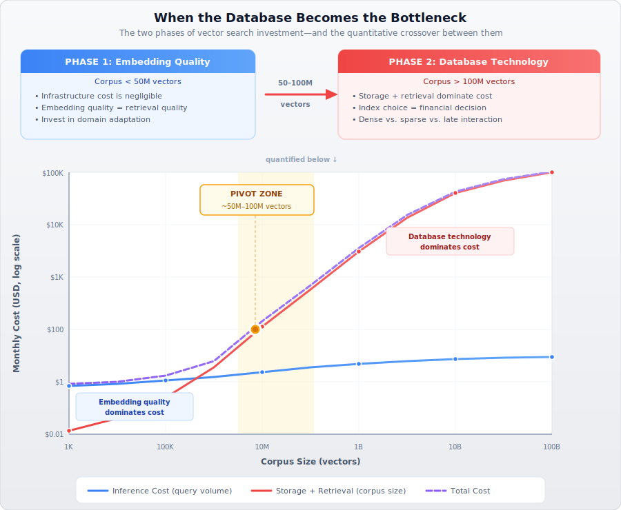
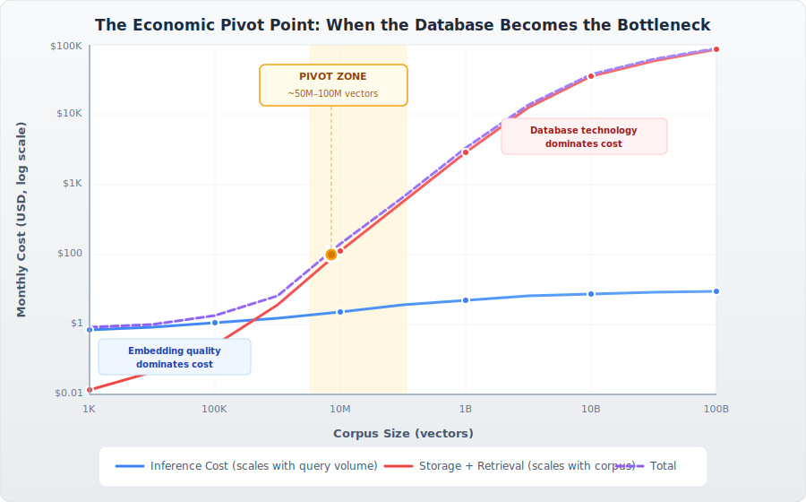
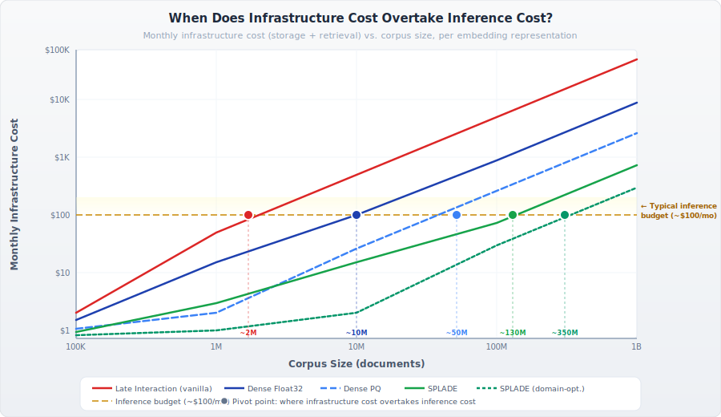
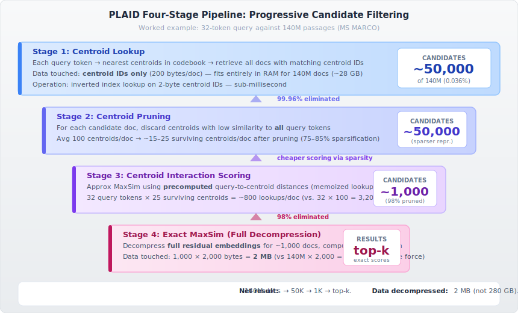
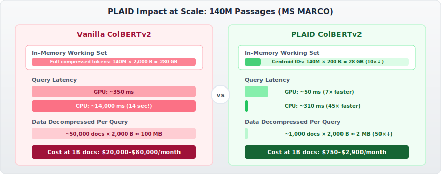

# When the Database Becomes the Bottleneck: The Economics of Vector Retrieval and the Technologies That Change the Math

**Reading Time:** ~30 minutes

---

> **TL;DR:** Embedding quality is the dominant factor in search relevance—but once your dataset crosses into the hundreds of millions of vectors, the economics shift dramatically. Storage and retrieval costs begin to dwarf inference, and the database technology you choose determines whether your system is viable at scale. This post builds an economic framework for understanding that pivot point, compares the operational costs of dense, late interaction, and sparse embeddings, and then does a deep dive into PLAID and MUVERA—two indexing technologies that fundamentally change the cost calculus for late interaction models.

---

## Setting the Stage: Where We Left Off

In my [previous post on domain-adapted neural search](https://sam-herman.github.io/blogs/embedding-adaptation-for-domain-specific), I argued that embedding quality is the most underleveraged factor in retrieval systems—easy to skip in the rush to get a pipeline running, but often the single highest-impact investment you can make. Domain adaptation, vocabulary extension, and careful fine-tuning can yield dramatic relevance improvements that no amount of index tuning can replicate.

That remains true. But now I want to complete the picture—because **both halves matter**, and the question of *which half matters more* depends entirely on scale.

*At small corpus sizes, embedding quality dominates the cost-quality equation. As the corpus grows, storage and retrieval costs climb linearly while inference stays nearly flat—crossing over around 50–100 million vectors. We'll derive these curves in detail below.*

Once you've invested in getting your embeddings right, the *database technology* becomes absolutely critical. And not in the way most people think.

The database doesn't just store and retrieve vectors. At scale, it determines whether your retrieval improvements are *economically feasible to operate*. It determines whether a research result translates into a production system that a business can actually run.

But the relationship runs deeper than a one-way pipeline from "embedding model" to "database." **The influence is bidirectional.** When ColBERT's multi-vector representations proved too expensive to index and retrieve at scale, the community didn't just wait for better hardware—it pushed back to the embedding design itself. SPLADE emerged as a direct response: a learned sparse model engineered to be *compatible with existing inverted index infrastructure*, deliberately trading some of ColBERT's expressiveness for the ability to leverage the most battle-tested indexing technology available. And then, when new indexing algorithms (PLAID, MUVERA) made multi-vector retrieval economically viable again, the pendulum swung back—enabling richer representations like ColPali and ColQwen that wouldn't have been pursued without confidence that the infrastructure could support them.

This bidirectional feedback loop—where embedding models shape what database technology needs to exist, and database economics shape what embedding models get designed—is one of the central themes of this post. It's the reason the story of retrieval isn't a clean linear progression, but a conversation between two evolving fields.

In this post, I want to build an economic framework for understanding when and why this shift happens, and then explore two technologies—**PLAID** and **MUVERA**—that are reshaping what's possible in the world of multi-vector retrieval.

---

## The Economic Pivot Point

### When Inference Dominates

At small to moderate scale, the dominant cost in a neural search system is **embedding inference**—the GPU compute required to encode queries and documents into vectors. Let's build some intuition for why, and ground our cost estimates in the specifics of what drives inference pricing.

#### What Drives Embedding Inference Cost?

Embedding inference cost is fundamentally a function of **model size** (parameter count), **hardware utilization**, and **throughput**. These factors interact in ways that are worth understanding before we plug numbers into a spreadsheet.

**Model parameters and their cost implications:** Embedding models span a wide range of sizes. At the compact end, `all-MiniLM-L6-v2` is a 6-layer transformer with ~22 million parameters producing 384-dimensional embeddings—small enough to run efficiently on a single CPU. Mid-range models like `bge-base-en-v1.5` and `GTE-base` are built on BERT-base architectures (~110M parameters, 768 dimensions), while `bge-large-en-v1.5` and `GTE-large` use BERT-large backbones (~335M parameters, 1024 dimensions). The newest generation of LLM-based embedding models—`e5-mistral-7b-instruct`, `gte-qwen2-7b`—scale up to 7 billion parameters but produce higher-quality embeddings, particularly for retrieval tasks.

The relationship between parameter count and cost is roughly linear for transformer-based models: more parameters means more floating-point operations per token, which translates directly to GPU-seconds per encoded document. A 7B parameter embedding model requires approximately 30–60× more compute per token than a 110M parameter model, but also tends to deliver meaningfully better retrieval quality.

**Hardware factors:** Inference cost also depends on the GPU (or CPU) hardware, its memory bandwidth, and how efficiently the deployment batches requests. An NVIDIA H100 can process embedding batches far faster than an A10G, but also costs proportionally more per hour. The key metric is **throughput (tokens/second/dollar)**—and here, newer hardware generally wins. On an H100 (with FP16 inference and dynamic batching), a 110M parameter model like `bge-base-en-v1.5` can encode upwards of 10,000 documents per second, while a 7B parameter model might manage 200–500 documents per second on the same hardware.

**Managed API vs. self-hosted economics:** Cloud API providers (OpenAI, Google, Cohere) fold all of this into a per-token price that amortizes hardware, batching efficiency, and operational overhead. Self-hosted deployments on dedicated GPUs can achieve significantly lower per-token costs at high utilization, but require engineering investment in serving infrastructure (e.g., HuggingFace Text Embeddings Inference, vLLM, or ONNX Runtime).

The following chart visualizes the relationship between model size, throughput, and self-hosted cost:

*Figure 1: Larger models produce better embeddings but at sharply lower throughput and higher cost. A 7B parameter model is ~100× slower than a 22M parameter model—but may deliver meaningfully better retrieval quality. The right choice depends on your quality requirements and scale.*

With that context, here are representative 2025 API pricing benchmarks:

| Provider / Model | Approx. Parameters | Dimensions | Price per Million Tokens |
|---|---|---|---|
| OpenAI `text-embedding-3-small` | undisclosed | 1,536 | $0.02 |
| OpenAI `text-embedding-3-large` | undisclosed | 3,072 | $0.13 |
| Google `gemini-embedding-001` | undisclosed | 768 | $0.15 |
| Cohere Embed 4 | undisclosed | 1,024 | $0.12 |
| Self-hosted `bge-base-en-v1.5` (H100) | ~110M | 768 | <$0.01 |
| Self-hosted `e5-mistral-7b` (H100) | ~7B | 4,096 | ~$0.03–0.05 |

*Note: OpenAI and Google do not disclose parameter counts for their embedding models, but pricing tiers strongly suggest the "small" variants use compact architectures (likely in the 100–300M range) while "large" variants use substantially bigger backbones. The pricing difference—6.5× between OpenAI's small and large—is consistent with the compute scaling you'd expect from moving to a model with roughly 5–10× more parameters.*

For a corpus of 1 million documents averaging 200 tokens each:

| Cost Component | Calculation | Cost |
|---------------|-------------|------|
| **Document encoding (one-time)** | 1M × 200 tokens × $0.10/M tokens | **$0.02** |
| **Query inference** (1K queries/day × 30 days) | 30K × 20 tokens × $0.10/M tokens | **$0.00006** |
| **Dense vector storage** (768D, Float32) | 1M × 3 KB ≈ 3 GB × $0.08/GB-month | **$0.24/month** |
| **Retrieval compute** | Negligible at this scale | **~$0** |

At this scale, the numbers are trivially small across the board. The inference cost is essentially a rounding error. The storage cost is pocket change. Everything fits in RAM on a modest instance. **The embedding model quality is the only thing that matters.**

This is the regime where my previous blog post's thesis holds with full force: invest everything in getting the embeddings right, because the infrastructure is cheap.

### When Storage and Retrieval Dominate

Now let's scale up. Something interesting happens as the dataset grows but query volume remains moderate—a pattern common in enterprise search, legal discovery, patent databases, scientific literature, and compliance systems where large corpora serve a relatively fixed user base.

Before we look at the numbers, let's ground the cost components in actual cloud infrastructure pricing so the estimates that follow aren't black boxes.

#### Grounding the Infrastructure Costs

**Storage costs** are relatively straightforward. Cloud block storage (AWS EBS gp3, GCP Persistent Disk) runs $0.08–$0.10/GB-month. Object storage (S3, GCS) is cheaper at ~$0.023/GB-month but introduces latency that makes it unsuitable for active vector indices. For OpenSearch Serverless, managed storage on S3 is billed at $0.024/GB-month. The estimates below use $0.08/GB-month as a representative mid-point for block storage suitable for active vector workloads.

**RAM and compute costs** are where things get interesting—and expensive. Vector similarity search with HNSW requires the index to reside in memory. As I discussed in [Part 1 of this series on GPU acceleration for vector search](https://sam-herman.github.io/blogs/gpu-for-vector-search), the raw vector data for an HNSW index already scales linearly ($N \times D \times B$ bytes), but the graph structure itself adds 20–40% overhead on top. For 768-dimensional Float32 vectors, each node in the HNSW graph requires the 3,072-byte vector plus ~160 bytes for neighbor links (with typical M=16–32), bringing total in-memory footprint to roughly **1.3–1.5× the raw vector data size**.

On AWS, memory-optimized instances commonly used for vector workloads price out as follows:

| Instance | vCPUs | RAM | On-Demand $/hr | Effective $/GB-RAM/month |
|---|---|---|---|---|
| `r6g.xlarge` | 4 | 32 GB | $0.10 | ~$2.28 |
| `r6g.4xlarge` | 16 | 128 GB | $0.40 | ~$2.28 |
| `r6g.16xlarge` | 64 | 512 GB | $1.61 | ~$2.29 |
| `r7g.16xlarge` | 64 | 512 GB | $1.72 | ~$2.45 |

*Prices shown for us-east-1; reserved instances reduce costs by 30–40%. Similar pricing exists on GCP (n2-highmem series) and Azure (E-series v5).*

For managed services like OpenSearch Serverless, compute is measured in OCUs (OpenSearch Compute Units). Each OCU provides 6 GB of RAM and corresponding vCPU at $0.24/OCU-hour ($175/OCU-month). Vector search collections require their own dedicated OCU pool, and the minimum deployment is 2 OCUs ($350/month) for a dev/test configuration or 4 OCUs ($700/month) for production with HA.

**ANN retrieval compute** is the subtlest cost to estimate. The compute required per query depends on the HNSW parameters (`M`, `efSearch`), vector dimensionality, and the number of distance calculations performed during graph traversal. Based on benchmarks from the [OpenSearch HNSW hyperparameter guide](https://opensearch.org/blog/a-practical-guide-to-selecting-hnsw-hyperparameters/) and consistent with my own findings in [Part 1 of this series](https://sam-herman.github.io/blogs/gpu-for-vector-search), a single HNSW query on 768-dimensional vectors with `efSearch=64` typically requires 500–2,000 distance computations. On modern CPUs with SIMD acceleration (as we explored with AVX-512 and NEON in Part 1), each distance computation takes on the order of 0.1–0.5 μs, putting single-query latency in the 1–5 ms range for million-scale indices and 5–20 ms for billion-scale.

The cost implication: for moderate query volumes (1K–10K queries/day), a single memory-optimized instance has more than enough compute headroom—the bottleneck is purely RAM capacity. But at high query volumes (100K+ queries/day) or with larger vectors, you need to distribute across multiple nodes for both memory capacity and query throughput, and the compute cost becomes non-trivial.

With all that grounding in place, here are the estimates:

**The Economics at 100 Million Vectors (768D Dense, Float32)**

| Cost Component | Derivation | Monthly Cost |
|---|---|---|
| **Query inference** (10K queries/day) | 300K queries × 20 tokens × $0.10/M tokens | ~$0.006 |
| **Dense vector storage** (300 GB raw + graph overhead ≈ 400 GB) | 400 GB × $0.08/GB-month | $32 |
| **RAM for in-memory HNSW index** | 400 GB → ~3× r6g.4xlarge (128 GB each) | $876 (on-demand) |
| **ANN index serving compute** | Included in instance cost at moderate query volume | (included above) |

**The Economics at 1 Billion Vectors (768D Dense, Float32)**

| Cost Component | Derivation | Monthly Cost |
|---|---|---|
| **Query inference** (10K queries/day) | Same as above | ~$0.006 |
| **Dense vector storage** (3 TB raw + graph overhead ≈ 4 TB) | 4 TB × $0.08/GB-month | $320 |
| **RAM for in-memory HNSW index** | 4 TB → ~8× r6g.16xlarge (512 GB each) | $9,400 (on-demand) |
| **ANN index serving compute** | Multi-node cluster, replication for HA | $14,000–$20,000+ |

*Note: At billion scale, most deployments use a combination of product quantization (reducing in-memory footprint by 4–32×, as covered in [Part 2 on PQ trade-offs](https://sam-herman.github.io/blogs/the-reality-of-vector-quantization)) and disk-backed approaches like DiskANN to bring RAM costs down significantly. The numbers above represent the unoptimized upper bound.*

The following chart illustrates this dynamic on a log-log scale. The inference cost curve (blue) remains nearly flat as the corpus grows—it's bounded by query volume, not corpus size. The storage and retrieval cost curve (red) climbs linearly with corpus size. At the pivot zone (roughly 50–100 million vectors), the curves cross.

*Figure 2: Cost crossover on a log-log scale. Inference cost scales with query volume (nearly flat), while storage and retrieval costs scale linearly with corpus size. The crossover at ~50–100M vectors marks the transition from an "embedding-quality-dominated" to a "database-technology-dominated" cost regime.*

The pattern is unmistakable. Query inference remains essentially flat—it scales with query volume, which is bounded by your user base. But storage and retrieval costs scale **linearly with corpus size**. At some point between 10 million and 100 million vectors, the cost curve crosses: storage-at-rest and online retrieval become the dominant expense.

> **The Pivot Point:** When corpus growth outpaces query volume growth—which is the case for the vast majority of enterprise search applications—the database technology becomes the critical cost driver, typically somewhere around **50–100 million vectors**.

This is the moment where the index technology transitions from "implementation detail" to "strategic decision." And this is where the choice between dense, sparse, and late interaction embeddings stops being a purely academic question and becomes a financial one.

---

## The Cost of Representation: Dense vs. Late Interaction vs. Sparse

Now that we understand *when* the database becomes critical, let's compare the three major embedding paradigms through an economic lens. But before diving into the numbers, it's worth framing what we're about to see—because the order in which these representations were developed tells a story about that bidirectional feedback loop.

Dense bi-encoders came first: simple, efficient, one vector per document. They worked well with nascent ANN indexing technology and scaled reasonably. Then came ColBERT, offering richer per-token representations with measurably better retrieval quality. The theory was compelling—but as we'll see in the numbers below, ColBERT's downstream storage and retrieval costs hit the pivot point almost immediately, making it impractical at any meaningful scale. The infrastructure simply couldn't support the representation.

That economic reality didn't just stay in the infrastructure layer—it *fed back into embedding research*. SPLADE was, in many ways, a direct answer to this feedback: "If the best representations can't be efficiently indexed, can we design representations that deliver most of the quality while fitting the indexing technology we already have?" The result was a learned sparse model that leverages inverted indices—trading some theoretical expressiveness for massive economic viability.

Understanding this history matters because the numbers below aren't just a static comparison. They explain *why the field evolved the way it did*, and they set the stage for understanding why PLAID and MUVERA matter: they're the infrastructure catching up, finally making richer representations viable again.

### Dense Embeddings: The Baseline

Let's follow that chronological thread and start with the simplest representation. A dense bi-encoder produces one vector per document. For a model with 768 dimensions at Float32 precision:

| Metric | Value |
|--------|-------|
| **Bytes per document** | 3,072 (768 × 4 bytes) |
| **Storage for 1B documents** | 3 TB |
| **Similarity operation** | One dot product (768 multiplications + additions) |
| **Index compatibility** | Standard HNSW, IVF, DiskANN |

Dense embeddings enjoy the most mature indexing ecosystem. Every major vector database supports them natively. ANN algorithms are highly optimized for single-vector search, and as I covered in [Part 2 of this series](https://sam-herman.github.io/blogs/the-reality-of-vector-quantization), product quantization can compress these vectors significantly (32:1 at the usable end of the spectrum) to bring costs down further.

### Late Interaction Embeddings: The Quality Premium

Dense embeddings set a solid baseline—but collapsing an entire document into a single vector inevitably loses information. ColBERT and its successors (ColBERTv2, ColPali, ColQwen) address this by producing **one vector per token** in a document, preserving fine-grained token-level interactions that a single pooled vector necessarily discards. For ColBERTv2 with 128-dimensional embeddings and an average document length of 100 tokens:

| Metric | Value |
|--------|-------|
| **Bytes per document** (uncompressed Float32) | 51,200 (100 tokens × 128 dims × 4 bytes) |
| **Bytes per document** (ColBERTv2 2-bit compressed) | 2,000 (100 tokens × 128 dims × 2 bits / 8 + overhead) |
| **Storage for 1B documents** (compressed) | ~2 TB |
| **Similarity operation** | MaxSim: matrix product of query tokens × document tokens |
| **Index compatibility** | **Requires specialized indexing (PLAID, or custom)** |

Even with ColBERTv2's aggressive 2-bit residual compression (we'll examine how this works in detail when we discuss PLAID later), the storage footprint remains comparable to uncompressed dense vectors. But the real cost isn't just storage—it's the **retrieval compute**. The MaxSim operation requires comparing *every* query token against *every* document token for each candidate, making brute-force retrieval approximately 100× more expensive than dense single-vector search (assuming ~32 query tokens × ~100 document tokens vs. a single dot product).

For a long time, this cost differential made late interaction a theoretical curiosity—wonderful on benchmarks, impractical in production. The retrieval quality improvements (often 5–15% nDCG improvement over dense models on standard benchmarks) simply weren't worth the **16–50× increase in storage** and **100× increase in retrieval compute** at scale.

This is our first concrete example of the database feeding back to the embedding model. ColBERT was designed to solve real problems with dense retrieval: better interpretability (you can trace which tokens matched), finer-grained relevance signals, and measurably higher quality. On its own merits, it was a clear advance. But when these representations met production-scale infrastructure, the economics were prohibitive. The downstream cost of storing and retrieving multi-vector embeddings didn't just make ColBERT expensive—it made researchers question whether the approach was viable at all, and directly motivated the search for alternatives that could deliver similar quality within the constraints of existing infrastructure.

> **The Late Interaction Paradox:** Late interaction models consistently deliver the best retrieval quality, but for years, there was no efficient index that could capitalize on those theoretical benefits at production scale. The database pushed back—and embedding researchers listened.

### Sparse Embeddings (SPLADE): The Efficiency Champion

And that listening produced our third paradigm. SPLADE is where the feedback loop from database to embedding model becomes most visible. Learned sparse models didn't emerge in a vacuum—they were a direct response to the economic impasse created by late interaction. When ColBERT's multi-vector representations proved too expensive to index and retrieve at production scale, and even dense ANN indices carried significant storage costs that ballooned with corpus size, researchers asked a different question: *instead of building new indexing technology for richer representations, can we design representations that work with the indexing technology we already have?*

SPLADE and similar learned sparse models are the answer. Instead of dense vectors, they produce sparse representations in vocabulary space (~30,000 dimensions for BERT-based models), where each non-zero dimension corresponds to a specific vocabulary term. This is a deliberate compromise on the expressiveness of ColBERT's per-token embeddings—but it's a compromise made with clear economic intent. By mapping into vocabulary space, SPLADE embeddings are natively compatible with inverted indices, the most mature and cost-efficient indexing technology available.

| Metric | Value |
|--------|-------|
| **Non-zero dimensions per document** | 100–300 (typical) |
| **Bytes per document** | ~800–2,400 (index + weight per non-zero term) |
| **Storage for 1B documents** | ~0.8–2.4 TB |
| **Similarity operation** | Sparse dot product (only non-zero terms) |
| **Index compatibility** | **Standard inverted index (Lucene, OpenSearch)** |

Here's what makes SPLADE particularly interesting from an economic standpoint: it delivers retrieval quality approaching late interaction models (within 2–5% on many benchmarks) while leveraging the most battle-tested indexing technology in existence—inverted indices. No specialized infrastructure needed. No custom ANN algorithms. Your existing Elasticsearch or OpenSearch cluster can serve SPLADE embeddings with minimal modification.

And recall from my previous blog that in our domain adaptation experiment, we compressed the effective SPLADE dimensionality to **only 11 non-zero terms** for domain-specific queries. That's another order of magnitude in storage and compute reduction.

### The Cost Comparison at Scale

Let's put this all together for 1 billion documents:

| Embedding Type | Storage per Doc | Total Storage (1B) | Retrieval Cost Factor | Quality (nDCG@10) |
|---------------|-----------------|--------------------|-----------------------|-------------------|
| **Dense (768D, PQ-compressed)** | ~96 bytes | ~96 GB | 1× (baseline) | ~0.40–0.45 |
| **Dense (768D, Float32)** | 3,072 bytes | 3 TB | 1× | ~0.40–0.45 |
| **Late Interaction (ColBERTv2, 2-bit)** | ~2,000 bytes | ~2 TB | **100× or more** | ~0.48–0.55 |
| **SPLADE (typical)** | ~1,200 bytes | ~1.2 TB | **0.3× (inverted index)** | ~0.45–0.52 |
| **SPLADE (domain-optimized, ~11 dims)** | ~88 bytes | ~88 GB | **0.03×** | domain-dependent |

> **The Insight:** SPLADE delivers 80–90% of late interaction quality at a fraction of the cost—often cheaper than even dense vectors. For text-only retrieval with well-adapted models, SPLADE is remarkably hard to beat on a cost/quality basis.

But the table alone doesn't capture how *dramatically* different these cost trajectories are as corpus size grows. The following chart shows monthly infrastructure cost (storage + retrieval compute) for each representation type on a log-log scale, with a horizontal reference line representing a typical inference budget (~$100/month). The point where each curve crosses that line is its **pivot point**—where the database technology overtakes embedding quality as the dominant cost factor:

*Figure 3: Infrastructure cost vs. corpus size for each embedding representation. Vanilla late interaction hits its pivot point at just ~2M documents—meaning infrastructure dominates cost almost immediately. Dense PQ reaches it around ~50M. Domain-optimized SPLADE doesn't cross until ~350M documents, giving you an enormous range where embedding quality investments remain the better use of your budget.*

The spread is striking. Late interaction's 100× retrieval cost multiplier means it enters "infrastructure-dominated" territory at corpus sizes where other representations are still comfortably in the "embedding-quality-dominated" phase. This is precisely *why* late interaction was considered impractical for so long—and why PLAID and MUVERA (which we'll explore next) represent such a significant shift in the economics.

---

## The VLM Plot Twist: Why Late Interaction Is Back

If the story ended here, the conclusion would be straightforward: invest in SPLADE, adapt it to your domain, and enjoy near-SOTA quality at rock-bottom infrastructure costs.

But the story doesn't end here.

**Vision-Language Models (VLMs)** and multi-modal encoders are changing the game. Models like ColPali and ColQwen use late interaction architectures to encode *images of documents*—PDF pages, slides, diagrams, scanned forms—into multi-vector representations. Each image patch becomes a token embedding, preserving spatial and visual information that simply cannot be captured by text-only models.

This is transformative for industries drowning in visual documents: financial reports with embedded charts, medical records with imaging, legal contracts with signatures and stamps, engineering specs with diagrams.

The problem is that there's no clean way to translate rich visual representations into sparse embeddings. You could run OCR, generate text descriptions, and encode those with SPLADE—but you'd lose the spatial relationships, the chart semantics, the diagram context. The latent visual information in those patch embeddings is precisely what makes multi-modal late interaction so powerful.

**Late interaction is back in play.** Not because the text retrieval community suddenly discovered it's better (they always knew), but because multi-modal applications *require* multi-vector representations, and the quality gap between "real" multi-vector similarity and any text-based approximation is too large to ignore.

Which brings us to the crux of this post: **if late interaction is necessary, how do we make it economically viable?**

The answer comes from two technologies that attack different parts of the cost equation: **PLAID** (storage and candidate generation) and **MUVERA** (retrieval compute).

---

## PLAID: Making Late Interaction Storage-Efficient

While SPLADE represented the field's adaptation *away* from multi-vector representations, the ColBERT authors took a different path. Rather than abandoning the expressiveness of late interaction, they turned the feedback loop into a research agenda: if the database infrastructure is the bottleneck, *fix the database infrastructure*.

This response was systematic. ColBERTv2 (2021) addressed the storage problem—introducing 2-bit residual compression that reduced per-document footprint from ~51 KB to ~2 KB, shrinking the gap from 16× to roughly comparable with uncompressed dense vectors. But storage was only half the equation. The *retrieval compute*—the cost of actually searching those multi-vector representations—remained the dominant expense.

PLAID (2022) followed as the direct answer to the retrieval cost problem. It represents a fascinating example of how algorithmic advances in ANN indexing technology can fundamentally reshape what's economically viable. Where SPLADE asked "can we change the embedding to fit existing infrastructure?", PLAID asked "can we build new infrastructure that makes the best embeddings affordable?" As we'll see, the answer turned out to be a qualified but compelling *yes*—and in doing so, PLAID made late interaction vectors potentially economically viable for the first time.

### The Core Problem PLAID Solves

Recall the fundamental challenge of ColBERT retrieval. You have a query with ~32 token embeddings and a corpus of billions of document token embeddings. For each query, you need to compute MaxSim—the sum of maximum cosine similarities between each query token and all document tokens:

$$\text{score}(q, d) = \sum_{i=1}^{|q|} \max_{j=1}^{|d|} \cos(q_i, d_j)$$

Vanilla ColBERTv2 handles this in two stages: first, it uses an inverted list of centroids to generate candidate documents, then it decompresses the full residual-encoded token embeddings for each candidate and computes exact MaxSim scores.

The problem is that the candidate generation stage is expensive and the decompression stage is slow. Even with ColBERTv2's residual compression, retrieving and scoring thousands of candidates requires touching enormous amounts of data.

### PLAID's Insight: Bags of Centroids

PLAID (Performance-optimized Late Interaction Driver) introduces a beautifully simple observation: **you don't need the full token embeddings to eliminate most of the corpus.**

During indexing, ColBERTv2 already quantizes each token embedding by assigning it to the nearest centroid from a learned codebook (typically 2^16 = 65,536 centroids) and storing a compressed residual. PLAID takes this further by observing that for the *initial filtering stage*, the centroids alone carry enough signal to prune the vast majority of non-relevant documents.

Here's the key intuition. If a document's tokens are all assigned to centroids that are distant from all query token embeddings, that document is almost certainly irrelevant. We don't need to decompress a single residual to figure this out—we can make that determination using only the centroid assignments.

### The PLAID Pipeline

PLAID implements a four-stage scoring pipeline, each stage progressively refining the candidate set:

**Stage 1: Candidate Generation via Centroid Lookup**

For each query token embedding, PLAID looks up the nearest centroids in the codebook. It then retrieves all documents that have *any* token assigned to those centroids. This produces a large initial candidate set—potentially tens of thousands of documents—but it's extremely fast because it's just an inverted index lookup on centroid IDs.

| Storage per document | Value |
|---------------------|-------|
| Centroid IDs only | ~100 × 2 bytes = 200 bytes per document |
| Full ColBERTv2 representation | ~100 × 20 bytes = 2,000 bytes per document |

The centroid-only representation is **10× smaller** than the full compressed representation, and it fits comfortably in memory even for billion-scale corpora.

**Stage 2: Centroid Pruning**

Not all centroids in a document contribute meaningfully to the MaxSim score. PLAID computes the similarity between each centroid in the candidate documents and the query token embeddings. Centroids with low similarity to *all* query tokens are pruned—effectively "sparsifying" the document representation.

This is mathematically justified because the MaxSim operation takes the *maximum* similarity for each query token. If a document centroid isn't the best match for any query token, it cannot contribute to the final score, so we can safely ignore it.

**Stage 3: Centroid Interaction Scoring**

Using only the surviving (non-pruned) centroids, PLAID computes an approximate MaxSim score. Since the centroids come from a fixed codebook, the query-to-centroid distances can be precomputed once and reused across all documents—the same memoization trick we discussed in the context of Product Quantization, applied here to centroid interactions.

This stage dramatically reduces the candidate set. Documents that score poorly using centroid-only similarity are eliminated without ever touching their full representations.

**Stage 4: Full Residual Decompression and Exact Scoring**

Only for the small number of surviving candidates (typically a few hundred out of the original millions) does PLAID decompress the full residual-encoded token embeddings and compute exact MaxSim. This is the expensive step, but it now applies to a tiny fraction of the corpus.

The following diagram traces a concrete query through all four stages:

*Figure 4: A 32-token query against 140M passages. Each stage dramatically narrows the candidate set while using progressively more expensive scoring. The total data decompressed drops from 280 GB (brute force) to just 2 MB—a 140,000× reduction.*

#### Worked Example: A Single Query Through PLAID

Let's trace the numbers explicitly. Suppose we have a 32-token query searching 140 million passages (MS MARCO scale), where each passage averages 100 tokens encoded with ColBERTv2 (128-dim embeddings, 2-bit residual compression):

| Stage | Candidates | Data Per Candidate | Total Data Touched | Operation |
|---|---|---|---|---|
| **1. Centroid Lookup** | 140M → ~50,000 | 200 bytes (centroid IDs) | 28 GB in-memory index | Inverted index lookup |
| **2. Centroid Pruning** | 50,000 (sparsified) | ~50 bytes (pruned IDs) | ~2.5 MB | Per-centroid similarity filter |
| **3. Centroid Interaction** | 50,000 → ~1,000 | Precomputed table lookups | ~6 MB (lookup table) | Approx MaxSim via memoization |
| **4. Exact MaxSim** | ~1,000 → top-*k* | 2,000 bytes (full residuals) | ~2 MB | Full decompression + exact scoring |

The critical insight is the data amplification ratio: Stage 1 operates on the **cheapest possible representation** (centroid IDs) against the **largest candidate set**, while Stage 4 operates on the **most expensive representation** (full residuals) against the **smallest candidate set**. This is precisely the right ordering for cost efficiency.

### Why This Works: The Mathematics of Centroid Sufficiency

The key theoretical insight behind PLAID is that centroid-only retrieval exhibits **high recall** relative to full ColBERT scoring. The paper demonstrates that if you retrieve 10× *k* documents using only centroid similarity, those documents contain 99%+ of the true top-*k* results from the full pipeline.

This works because of how the codebook is constructed. During training, k-means clustering groups similar token embeddings together. Tokens assigned to the same centroid are, by definition, close in embedding space. The centroid is a good proxy for any individual token in its cluster, and the residual (the difference between the token and its centroid) captures only a small correction.

Formally, for a token embedding $t$ assigned to centroid $c$ with residual $r = t - c$:

$$\cos(q, t) = \cos(q, c + r) \approx \cos(q, c) + \text{small correction}$$

When we're only trying to *rank* documents (not compute exact scores), the centroid similarity is usually sufficient to identify the right candidates.

### PLAID Performance Results

The results are striking. On MS MARCO passage retrieval at 140 million passages:

| System | Latency (GPU) | Latency (CPU) | MRR@10 |
|--------|--------------|---------------|--------|
| Vanilla ColBERTv2 | ~350 ms | ~14,000 ms | 0.397 |
| PLAID ColBERTv2 | ~50 ms | ~310 ms | 0.397 |
| **Speedup** | **7×** | **45×** | **No quality loss** |

PLAID achieves these speedups **without any degradation in retrieval quality**. The MRR@10 is identical to vanilla ColBERTv2 because the final stage still computes exact MaxSim—PLAID only accelerates the candidate filtering, not the final scoring.

The side-by-side comparison makes the impact concrete:

*Figure 5: Vanilla ColBERTv2 vs. PLAID at 140M passages. PLAID reduces the in-memory working set by 10×, GPU latency by 7×, CPU latency by 45×, and per-query data decompression by 50×—all with zero quality loss.*

> **What PLAID Saves:** PLAID primarily reduces **retrieval latency** and **storage I/O** by keeping the working set (centroid IDs) small enough to fit in memory while deferring expensive decompression to only the most promising candidates. It transforms ColBERT from a system that requires touching terabytes of data per query into one that touches megabytes.

---

## MUVERA: Reducing Multi-Vector Search to Single-Vector MIPS

### The Problem PLAID Doesn't Solve

PLAID is a remarkable engineering achievement, but it has an architectural limitation: it requires a **custom retrieval pipeline**. You can't simply drop ColBERT embeddings into an off-the-shelf vector database and expect efficient retrieval. PLAID needs its own inverted index structure, its own centroid pruning logic, and its own multi-stage pipeline.

This matters because the single-vector MIPS (Maximum Inner Product Search) ecosystem has had decades of optimization. Algorithms like HNSW, IVF, and DiskANN are battle-tested, highly optimized, and available in every major vector database. If we could somehow *reduce* multi-vector retrieval to single-vector MIPS, we could leverage this entire ecosystem for free.

That's exactly what MUVERA does.

### MUVERA's Key Idea: Fixed Dimensional Encodings

MUVERA (Multi-Vector Retrieval Algorithm) introduces a mathematical transformation that converts a variable-length set of vectors (a multi-vector embedding) into a single fixed-length vector called a **Fixed Dimensional Encoding (FDE)**. The critical property of this transformation is that the dot product between two FDEs approximates the Chamfer similarity between the original multi-vector sets.

Let me unpack that because it's a beautiful piece of mathematics.

**Chamfer Similarity** (the scoring function used by ColBERT and similar models) between a query set $Q = \{q_1, ..., q_m\}$ and a document set $P = \{p_1, ..., p_n\}$ is:

$$\text{CHAMFER}(Q, P) = \sum_{i=1}^{m} \max_{j=1}^{n} \langle q_i, p_j \rangle$$

This is a non-linear, asymmetric function—the max operation prevents it from decomposing into a simple linear algebra operation. You can't just concatenate or average the vectors and get the right answer.

MUVERA's insight is to use **randomized space partitioning** to convert this non-linear problem into a linear one. Here's how.

### The FDE Construction Algorithm

**Step 1: Partition the Embedding Space**

MUVERA uses SimHash (a form of locality-sensitive hashing) to partition $\mathbb{R}^d$ into $K$ regions. The critical property of SimHash is that vectors that are close in the original space are likely to land in the same partition. Each partition roughly corresponds to a "neighborhood" of semantically similar token embeddings.

**Step 2: Assign Vectors to Partitions**

For each vector in a multi-vector set, MUVERA determines which partition it falls into. Vectors from the same semantic neighborhood (e.g., all token embeddings related to "financial analysis") will tend to cluster in the same partitions.

**Step 3: Aggregate Within Partitions**

Within each partition, the vectors are aggregated—typically by summing and projecting to a lower dimension. This produces a fixed-size "summary" for each partition.

**Step 4: Concatenate Partition Summaries**

The per-partition summaries are concatenated into a single fixed-dimensional vector. The total FDE dimension is $r \times K \times d_{\text{proj}}$, where $r$ is the number of independent repetitions (for concentration of measure), $K$ is the number of partitions, and $d_{\text{proj}}$ is the projection dimension per partition.

**Why This Preserves Similarity**

The key mathematical insight is that if query token $q_i$ and its best-matching document token $p_{j^*}$ are in the *same partition* (which SimHash ensures with high probability for similar vectors), then the dot product of their respective partition summaries will capture that match. By repeating this process $r$ times with independent random partitions, MUVERA achieves concentration—the FDE dot product converges to a good approximation of the true Chamfer similarity.

Formally, MUVERA proves:

$$\mathbb{E}[\langle F_q(Q), F_{\text{doc}}(P) \rangle] \approx \text{CHAMFER}(Q, P) \pm \epsilon$$

This is the first algorithm providing a **single-vector proxy for multi-vector similarity with theoretical guarantees**. Prior approaches were heuristics with no approximation bounds.

### Asymmetric Encoding: A Crucial Detail

MUVERA's encoding is **asymmetric**—the query FDE and document FDE are constructed differently. This is essential because Chamfer similarity itself is asymmetric: it sums over query tokens, not document tokens. The query encoding emphasizes *which* partitions are "active" (contain query tokens), while the document encoding ensures all document tokens contribute to their respective partitions regardless of the query.

This asymmetry means document FDEs can be precomputed and indexed offline, while query FDEs are computed at query time—exactly the pattern needed for efficient retrieval.

### MUVERA's Retrieval Pipeline

Compared to PLAID's four-stage pipeline, MUVERA's is refreshingly simple:

1. **Offline:** Compute document FDEs from ColBERT token embeddings. Index using any standard MIPS solver (e.g., DiskANN, HNSW).
2. **Online:** Compute query FDE. Run single-vector ANN search to retrieve top candidates.
3. **Re-rank:** Score candidates using exact Chamfer similarity on the original multi-vector representations.

That's it. No custom inverted indices. No centroid pruning. No multi-stage pipeline. Just standard single-vector ANN search with a re-ranking step.

### MUVERA Performance Results

On the BEIR benchmark suite with ColBERTv2:

| System | Recall@100 | Avg Latency | vs PLAID |
|--------|-----------|-------------|----------|
| PLAID | 0.85 | 100–300 ms | Baseline |
| MUVERA | 0.93 | 10–30 ms | **10% better recall, 90% lower latency** |

MUVERA achieves its candidates with 2–5× fewer retrieved candidates than PLAID's heuristic-based approach, meaning less data touched and less re-ranking needed.

### The Trade-offs

MUVERA is not without costs:

**FDE Size:** The FDE vectors are large. A typical configuration (e.g., $r=20$ repetitions, $K=64$ partitions, $d_{\text{proj}}=32$ projection dimensions) produces FDEs of dimension $20 \times 64 \times 32 = 40,960$. That's significantly larger than a typical dense embedding. However, these vectors are amenable to standard quantization techniques (PQ, scalar quantization) since they're single vectors in a standard MIPS setup.

**Recall Trade-off:** The FDE approximation introduces some recall loss compared to exact Chamfer search. In practice, this is mitigated by the re-ranking step—the FDE only needs to be good enough to put the right documents in the candidate set, not to produce exact scores.

**No Free Lunch:** The combination of FDE storage plus the original multi-vector storage for re-ranking means MUVERA's total storage footprint can be larger than PLAID's. The win is in *compute*—using optimized MIPS infrastructure instead of custom multi-stage pipelines.

---

## PLAID vs. MUVERA: Complementary Approaches

It's tempting to ask "which one is better?" but that's the wrong question. PLAID and MUVERA address different aspects of the late interaction cost problem:

| Dimension | PLAID | MUVERA |
|-----------|-------|--------|
| **Primary savings** | Storage I/O, candidate generation | Retrieval compute via MIPS reduction |
| **Infrastructure** | Custom pipeline required | Works with off-the-shelf MIPS solvers |
| **Index structure** | Centroid inverted lists + residuals | Standard ANN index (HNSW, DiskANN) |
| **Theoretical guarantees** | Empirical (99%+ recall shown) | Formal ε-approximation bounds |
| **Re-ranking** | Uses own residual decompression | Uses original multi-vector Chamfer |
| **Best for** | Dedicated ColBERT infrastructure | Integrating multi-vector into existing vector DB |
| **Maturity** | Production-tested (Stanford NLP) | Newer, production implementations emerging |

In practice, these approaches may even be **complementary**. A system could use MUVERA's FDE for initial candidate generation via an off-the-shelf ANN index, then use PLAID's centroid interaction for an efficient intermediate scoring stage before final re-ranking with exact Chamfer similarity. This three-tier approach would combine MUVERA's infrastructure compatibility with PLAID's efficient intermediate scoring.

---

## Revisiting the Decision: From "No" to "Maybe"

Let's return to our economic framework. Before PLAID and MUVERA, the late interaction cost equation looked like this at 1 billion documents:

**Before: Late Interaction (Vanilla ColBERTv2)**

| Cost Component | Monthly Cost |
|---------------|-------------|
| Storage (2 TB compressed) | $160–$480 |
| Retrieval compute (100× dense) | $20,000–$80,000 |
| **Total** | **$20,160–$80,480** |

vs. Dense retrieval at the same scale:

**Dense Retrieval (768D, PQ-compressed)**

| Cost Component | Monthly Cost |
|---------------|-------------|
| Storage (96 GB) | $8–$24 |
| Retrieval compute (baseline) | $200–$800 |
| **Total** | **$208–$824** |

Late interaction was 25–100× more expensive. For a 5–15% quality improvement, that's almost never justified.

**After: Late Interaction with PLAID**

| Cost Component | Monthly Cost |
|---------------|-------------|
| Storage (centroid IDs in RAM + residuals on disk) | $300–$900 |
| Retrieval compute (7× faster on GPU, 45× on CPU) | $450–$2,000 |
| **Total** | **$750–$2,900** |

**After: Late Interaction with MUVERA**

| Cost Component | Monthly Cost |
|---------------|-------------|
| FDE storage + original multi-vector storage | $400–$1,200 |
| Retrieval compute (standard MIPS + re-ranking) | $300–$1,500 |
| **Total** | **$700–$2,700** |

The cost gap has shrunk from 25–100× to **3–5×**. For applications where the quality improvement matters—legal discovery, medical literature search, multi-modal document retrieval—this is now firmly in the territory of "worthwhile trade-off."

And for multi-modal applications (ColPali, ColQwen) where there is no sparse embedding alternative, PLAID and MUVERA don't just improve the economics—they make multi-vector retrieval **possible** at scale for the first time.

> **The Verdict:** What was once a hard "no" to late interaction at production scale has become a soft "yes"—or at minimum, a much softer "no." For text-only retrieval where SPLADE is viable, sparse embeddings remain the cost-performance champion. But for multi-modal retrieval, and for text applications where that extra 5–15% quality matters, PLAID and MUVERA have changed the math.

---

## The Feedback Loop: A Theme Revisited

We've seen this dynamic play out at every stage of the analysis. Index technology doesn't just *enable* embedding models—it actively shapes which ones get designed, funded, and deployed.

ColBERT demonstrated the quality potential of late interaction, but infrastructure costs pushed the field toward SPLADE—a compromise engineered to fit existing inverted indices. ColBERTv2 and PLAID then pushed back from the infrastructure side, making multi-vector retrieval affordable enough that researchers felt confident investing in richer representations again. ColPali and ColQwen exist partly because the community now believes that multi-vector retrieval at scale is *solvable*.

This bidirectional feedback loop—where index capabilities inform embedding design, and embedding requirements drive index innovation—is one of the most productive dynamics in information retrieval research right now. It's why I believe the next few years will see rapid progress on both fronts simultaneously.

---

## Practical Recommendations

For practitioners deciding how to architect their retrieval systems today:

**If your corpus is < 50 million documents and text-only:**
Invest your effort in embedding quality. Use dense or SPLADE embeddings. The index is not your bottleneck. Read my [previous post](https://sam-herman.github.io/blogs/embedding-adaptation-for-domain-specific) on domain adaptation.

**If your corpus is 50M–1B documents and text-only:**
Seriously evaluate SPLADE with domain adaptation. You'll get near-SOTA quality with inverted index infrastructure you probably already have. Dense with PQ compression (see [Part 2 of this series](https://sam-herman.github.io/blogs/the-reality-of-vector-quantization)) is also viable if you need pure dense similarity.

**If you need multi-modal retrieval (documents with images, charts, PDFs):**
Late interaction (ColPali/ColQwen) is your best path to quality. Use MUVERA if you want to leverage existing vector database infrastructure. Use PLAID if you're building dedicated retrieval infrastructure and want the most mature solution.

**If you're at >1B scale with any embedding type:**
You're in custom infrastructure territory. Evaluate PLAID + MUVERA as a combined pipeline. The economics at this scale demand careful benchmarking on your specific workload.

---

## Looking Forward

We're living through a remarkable period in information retrieval. The convergence of multi-modal models, efficient indexing algorithms, and dropping hardware costs is making retrieval architectures possible that were purely theoretical just two years ago.

The next frontiers I'm watching closely:

- **MUVERA + Product Quantization:** Compressing the large FDE vectors with PQ could dramatically reduce MUVERA's storage overhead.
- **Hardware-aware multi-vector indexing:** Modern GPUs and custom accelerators are particularly well-suited to the batched matrix operations that MaxSim requires. PLAID on GPU is already 7× faster—purpose-built hardware could push this further.
- **End-to-end learned quantization for late interaction:** Rather than applying PQ post-hoc, training the embedding model to produce quantization-friendly representations could improve the compression-quality trade-off.
- **Hybrid sparse + late interaction systems:** Using SPLADE for initial retrieval and ColBERT for re-ranking combines the efficiency of sparse search with the quality of late interaction.

As we continue building and integrating with OpenSearch, these technologies represent the cutting edge of what's possible in production vector search. The goal, as always, is finding the optimal balance between scale, speed, quality, and cost.

The database was never "just" the database. At scale, it's the enabler that determines whether your AI can actually serve users—or remains a promising benchmark result gathering dust on a researcher's laptop.

---

*This analysis is based on publicly available research papers, benchmark results, and cloud pricing data as of early 2026. Actual costs vary significantly based on cloud provider, instance type, query patterns, and dataset characteristics. Always benchmark on your specific workload.*

**Previous in the series:** [The Reality of Vector Quantization: A Deep Dive into Product Quantization Trade-offs](https://sam-herman.github.io/blogs/the-reality-of-vector-quantization)

**Previous:** [Teaching Embedding Models New Words: A Deep Dive into Domain Adaptation](https://sam-herman.github.io/blogs/embedding-adaptation-for-domain-specific)

## References

1. **Santhanam, K., Khattab, O., Potts, C., & Zaharia, M.** (2022). PLAID: An Efficient Engine for Late Interaction Retrieval. *Proceedings of the 31st ACM International Conference on Information and Knowledge Management (CIKM '22)*. [arXiv:2205.09707](https://arxiv.org/abs/2205.09707)

2. **Dhulipala, L., Jayaram, R., Knittel, A., Liu, J., & Mirrokni, V.** (2024). MUVERA: Multi-Vector Retrieval via Fixed Dimensional Encodings. *Advances in Neural Information Processing Systems 37 (NeurIPS 2024)*. [arXiv:2405.19504](https://arxiv.org/abs/2405.19504)

3. **Khattab, O. & Zaharia, M.** (2020). ColBERT: Efficient and Effective Passage Search via Contextualized Late Interaction over BERT. *Proceedings of the 43rd International ACM SIGIR Conference on Research and Development in Information Retrieval*.

4. **Santhanam, K., Khattab, O., Saad-Falcon, J., Potts, C., & Zaharia, M.** (2021). ColBERTv2: Effective and Efficient Retrieval via Lightweight Late Interaction. *arXiv:2112.01488*.

5. **Faysse, M., Fernandes, H., Music, N., Music, E., Music, N.** (2024). ColPali: Efficient Document Retrieval with Vision Language Models. *arXiv:2407.01449*.

6. **Formal, T., Piwowarski, B., & Clinchant, S.** (2021). SPLADE: Sparse Lexical and Expansion Model for First Stage Ranking. *Proceedings of the 44th International ACM SIGIR Conference*.

7. **Jégou, H., Douze, M., & Schmid, C.** (2011). Product Quantization for Nearest Neighbor Search. *IEEE TPAMI*, 33(1), 117-128.

8. **Subramanya, S. J., et al.** (2019). DiskANN: Fast Accurate Billion-Point Nearest Neighbor Search on a Single Node. *NeurIPS 2019*.

9. **Malkov, Y. A., & Yashunin, D. A.** (2018). Efficient and Robust Approximate Nearest Neighbor Search Using Hierarchical Navigable Small World Graphs. *IEEE TPAMI*, 42(4), 824-836.

10. **Herman, S.** (2025). Teaching Embedding Models New Words: A Deep Dive into Domain Adaptation. [Blog post](https://sam-herman.github.io/blogs/embedding-adaptation-for-domain-specific).

11. **Herman, S.** (2025). The Reality of Vector Quantization: A Deep Dive into Product Quantization Trade-offs. [Blog post](https://sam-herman.github.io/blogs/the-reality-of-vector-quantization).