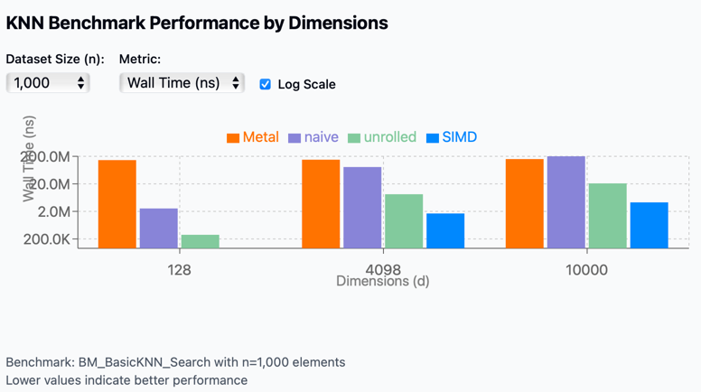
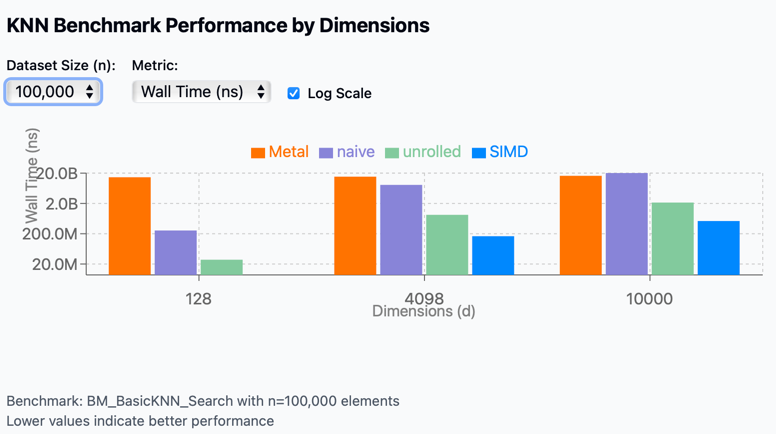

# KNN Part I - Are GPUs Good For Vector Search?

I recently began a personal project exploring multi-modal search, which led me to investigate cutting-edge embedding models and vector search solutions. Vector search (often called KNN or K Nearest Neighbors) identifies the most similar vectors to a query vector, enabling us to find closely related images or semantically similar text.

My work on [jVector](https://github.com/jbellis/jvector) introduced me to ANN (Approximate Nearest Neighbor) indexing—a more efficient but less accurate alternative to KNN that makes high-dimensional vector search feasible at scale. What had previously been an abstract concept became a concrete challenge my team at Datastax was actively addressing.

In this article, I'll share my vector search journey, including discoveries about CPU/GPU instructions, performance profiling, and the reality behind hardware acceleration claims for vector search operations.

## Why Care So Much About Hardware?
Before diving deeper, let's question why hardware acceleration matters for vector search. While ANN indices offer $O(\log n)$  complexity with "slight" accuracy reductions, this simplification overlooks key considerations.

These accuracy tradeoffs are measured in "recall" (how well ANN results match KNN results), but KNN itself isn't perfect. Its accuracy depends entirely on the embedding model's quality. Consider the popular text embedding model `all-MiniLM-L6-v2`, which averages only [68.06%]((https://www.sbert.net/docs/sentence_transformer/pretrained_models.html#all-minilm-l6-v2)) accuracy.

Starting with this inherent limitation raises a critical question: why add an indexing layer that further reduces accuracy? Perhaps brute force KNN, while $O(n)$ in complexity, could be viable with proper hardware acceleration rather than compounding accuracy losses through approximation methods.

## Evaluating KNN: Is It Worth the Cost?

To properly assess whether KNN is the right approach, we need to consider three key factors:

1. The computational expense of KNN
2. The accuracy compromises introduced by ANN alternatives
3. The ongoing operational overhead of maintaining and tuning a vector index

This article (Part I of this series) will focus exclusively on the first factor: computational cost. If we can demonstrate that KNN's compute requirements are actually manageable, we might avoid unnecessary complexity—why implement additional layers if the simpler approach is sufficient?

## Compute Cost Of KNN
We will denote the asymptotically linear runtime complexity $O(N)$, where $N=n*d$, with the definition of
1. $n$ - Number of vectors
2. $d$ - Vector Dimension
3. $N$ - number of operations performed

### Euclidean Distance As Case Study
Take the Euclidean distance between two vectors ${p}$ and ${q}$ as our case study:

$d(p,q) = \sqrt{\sum_{i=1}^n (p_i - q_i)^2}$ 

It nicely embeds in itself all the other common distance computations in some form:

$\text{Euclidean Distance: } d(p,q) = \sqrt{\sum_{i=1}^n (p_i - q_i)^2}$

$\text{Cosine Similarity: } \cos(\theta) = \frac{p \cdot q}{\|p\| \|q\|} = \frac{\sum_{i=1}^n p_i q_i}{\sqrt{\sum_{i=1}^n p_i^2} \sqrt{\sum_{i=1}^n q_i^2}}$

$\text{Vector Normalization: } \hat{p} = \frac{p}{\|p\|} = \frac{p}{\sqrt{\sum_{i=1}^n p_i^2}}$

$\text{Relationship: } d^2(p,q) = \|p\|^2 + \|q\|^2 - 2\|p\|\|q\|\cos(\theta)$

So if we got the Euclidean distance optimized right, we are probably going to solve for the others as well.

### Naive Implementation
First, lets analyze the naive implementation of Euclidean distance, and later we can try and think of possible optimization ways.
For clarity lets use `C++` as the implementation language so we can better reason about the low level overhead of the CPU instructions.

Let's define an interface for Euclidean distance calculations in a header file `DistanceCalculator.h` and the various implementations in `DistanceCalculator.cpp`:

**`DistanceCaclulator.h`**
```c++
class DistanceCalculator {
    public:
      /**
       * Calculates the Euclidean distance between two vectors.
       *
       * The Euclidean distance is computed as the square root of the
       * squared Euclidean distance between the two vectors.
       *
       * @param v1 The first vector.
       * @param v2 The second vector.
       * @return The Euclidean distance between the two vectors.
       */
      static float calculateEuclideanDistance(const std::vector<float> &v1, const std::vector<float> &v2);
}
```

**`DistanceCalculator.cpp`**
```c++
float DistanceCalculator::calculateEuclideanDistance(const std::vector<float> &v1, const std::vector<float> &v2) {
  return std::sqrt(calculateSquaredEuclideanDistance(v1, v2));
}
```

An immediate couple of quick observations we can do to streamline the computation are the following:
1. To find the Euclidean distance we really need to only find the squared Euclidean distance $d^2(p,q) = \sum_{i=1}^n (p_i - q_i)^2$ and then just add then just apply square root $d(p,q) = \sqrt{d^2(p,q)}$
2. Since ordering between our results is relative, the final score doesn't really have much meaning so we can probably just focus on $d^2(p,q)$ and use it directly for our calculations. It is often referred as $L2$ distance for short


For the naive implementation of $L2$ we are just going to implement the distance exactly literally as we read the logic from the squared distance formula
$d^2(p,q) = (p_1 - q_1)^2 + (p_2 - q_2)^2 + ... + (p_n - q_n)^2$ and add the following implementation:

**`DistanceCalculator.cpp`**
```c++
float DistanceCalculator::calculateSquaredEuclideanDistance(const std::vector<float> &v1,
                                                            const std::vector<float> &v2) {
  float distance = 0.0;
  for (int i = 0; i < v1.size(); i++) {
    distance += std::pow(v1.at(i) - v2.at(i), 2);
  }
  return distance;
}
```

In the following section we will look at possible optimizations with and without various hardware acceleration techniques and will have a benchmark and later analysis of the benchmark results.

## Optimization Techniques

[naive]: #naive-implementation

The naive example presented in the [Naive Implementation][naive] section may be later optimized differently depending on the different compiler used.
However, we would still bring up potential manual optimizations that can be done in the code and later evaluate performance in our benchmark to see whether those optimizations worth the effort on the readability overhead of our code.

Note: while the below optimizations might make perfect sense in theory, we will later benchmark and test each one of them to confirm those actually hold true!

### Unrolled Loop
One issue for [Naive Implementation][naive] like the above is the repeated conditional checks for the loop termination `i < v1.size()`.
Common technique that is used in this case is known as "Loop Unrolling". What loop unrolling actually means is that we have a loop that goes in wider increments and avoids the additional overhead of loop termination check in each step.
Let's add a typical loop unrolling implementation:

**`DistanceCalculator.cpp`**
```c++
float DistanceCalculator::calculateSquaredEuclideanDistanceWithLoopUnrolling(const std::vector<float> &v1,
                                                                             const std::vector<float> &v2) {
  assert(v1.size() == v2.size()); // Ensure both vectors have the same size

  size_t size = v1.size();
  size_t unrolledSize = size - (size % 4);

  float distance = 0.0f;

  for (size_t i = 0; i < unrolledSize; i += 4) {
    float diff0 = v1[i] - v2[i];
    float diff1 = v1[i + 1] - v2[i + 1];
    float diff2 = v1[i + 2] - v2[i + 2];
    float diff3 = v1[i + 3] - v2[i + 3];

    distance += diff0 * diff0 + diff1 * diff1 + diff2 * diff2 + diff3 * diff3;
  }

  for (size_t i = unrolledSize; i < size; i++) {
    float diff = v1[i] - v2[i];
    distance += diff * diff;
  }

  return distance;
}
```

The above code reduces the number of loop termination conditions executed by a factor of `4x`!

### SIMD unrolled loop
With our unrolled loop implementation we were able to reduce the number of termination check on the loop.
Another optimization techniques we can add on top of that is leveraging special hardware acceleration method available in many modern CPUs and GPUs called "Single Instruction Multiple Data" (aka. SIMD for short).

##### What SIMD Does?
SIMD allows a single CPU instruction to perform the same operation on multiple data points simultaneously, rather than processing them one by one. For L2 distance calculations, this is particularly valuable because:
1. **Parallel Processing**: When calculating L2 distance, you need to perform the same operation (subtraction, squaring, addition) across many vector dimensions. SIMD can process 4, 8, 16 or even more dimensions at once, depending on the instruction set.
2. **Operation Batching**: Instead of executing each mathematical operation separately for each dimension, SIMD batches them together.

For the purposes of this basic evaluation, I'm using an M series Mac with Apple Silicon, I will use the SIMD native libraries on the mac that interface with its custom NEON architecture that can take a 128 bit (4 floats) vector width per operation.
Keep in mind however that popular CPU instruction sets exist for SIMD with different memory widths, to name a few:
- **AVX-512**: Can process 16 single-precision floats at once
- **AVX2/AVX**: Can process 8 single-precision floats at once
- **SSE**: Can process 4 single-precision floats at once

**`DistanceCalculator.cpp`**
```c++
float DistanceCalculator::calculateSquaredEuclideanDistanceWithSIMD(const std::vector<float> &v1,
                                                                    const std::vector<float> &v2) {
  /* 1. Assert the Dimensions:*/
  assert(v1.size() == v2.size()); // Ensure both vectors are of the same size

  /* 2. Determine Sizes: */
  size_t size = v1.size(); // The total size of the vectors.
  // The largest multiple of 4 that fits within size.
  // This is necessary because SIMD processes 4 floats at a time (with 128-bit operations when using SIMD intrinsics).
  size_t simdSize = size - (size % 4);

  /* 3. Initialize Variables:*/
  // To store the final squared Euclidean distance value.
  float distance = 0.0f;

  // A SIMD register initialized to zero.
  simd_float4 sum = simd_make_float4(0.0f, 0.0f, 0.0f, 0.0f);

  /* 4. Main SIMD Loop */
  for (size_t i = 0; i < simdSize; i += 4) {
    simd_float4 vec1 = simd_make_float4(v1[i], v1[i + 1], v1[i + 2], v1[i + 3]);
    // Constructs a SIMD vector from v1 elements.
    simd_float4 vec2 = simd_make_float4(v2[i], v2[i + 1], v2[i + 2], v2[i + 3]);
    // Constructs a SIMD vector from v2 elements.
    simd_float4 diff = vec1 - vec2; // Performs element-wise subtraction of vec1 and vec2.
    simd_float4 squared = diff * diff; // Squares each element of the subtraction result (diff).
    sum += squared; // Adds the squared results to the running total in sum.
  }

  // Sum up results from the SIMD register
  distance = sum[0] + sum[1] + sum[2] + sum[3];

  // Handle remainder elements
  for (size_t i = simdSize; i < size; i++) {
    distance += (v1[i] - v2[i]) * (v1[i] - v2[i]);
  }

  return distance;
}
```

Let's take a moment to reason about the code above. Previously for vectors $A$ and $B$ the L2 calculation logic looked something like this (pseudocode):
```shell
For each dimension i:
  Calculate difference: diff_i = A_i - B_i
  Square the difference: squared_diff_i = diff_i * diff_i
  Add to running sum: sum += squared_diff_i
Take square root of sum
```

And now it looks more like this:
```shell
Load multiple dimensions of A into SIMD register
Load multiple dimensions of B into SIMD register
Subtract B from A for all dimensions simultaneously
Square all differences simultaneously
Sum all squared differences (often using specialized horizontal sum instructions)
Take square root of result
```

The main difference here is that we saved instructions to load registers. 
Here we used 4x fewer instructions than the previous examples to load values into CPU registers to perform the calculations, which means (if everything works as expected) an additional 4x performance speedup. 

### GPU unrolled loop
Similar to the hardware acceleration with SIMD approach, we might want to take the idea of parallelism of distance computations to the limit by leveraging a GPU.

#### What are the *potential* advantages of GPUs for distance computations?
- **Massive Parallelism**: GPUs have thousands of cores designed for parallel operations.
- **Specialized Instructions**: Modern GPUs include optimized instructions for vector operations and matrix mathematics.
- **High Memory Bandwidth**: GPUs can transfer large vector datasets quickly, which is crucial when comparing against large vector databases.
- **Tensor Cores**: Advanced GPUs (like NVIDIA's with Tensor Cores) provide specialized hardware for matrix operations, further accelerating these calculations.

#### Potential GPU Trade-offs
While in theory GPU sounds like the perfect candidate for distance computation acceleration, there are in fact hidden limitations (as we will also see pretty soon in the benchmarks):
- **Data Transfer Overhead**: Moving data between CPU and GPU memory can create bottlenecks for smaller searches
- **Kernel Launch Overhead**: Initiating an operation on the GPU might have additional overhead for *GPU Kernel* [launch](https://www.hpcs.cs.tsukuba.ac.jp/icpp2019/data/posters/Poster17-abst.pdf). This can get quite costly and can negate the potential parallelism advantages for small computations.

We will come back  to explore the balance between tradeoffs and advantages of GPU utilization for vector search computation later on when we go over the benchmarks and their results.

For now lets take a look at the implementation of GPU acceleration for Euclidean distance on the Apple Silicon Mac.
First and foremost we would need to define a computational GPU kernel for the Euclidean distance using Apple's Metal framework:
**`SquaredDistanceKernel.metal`**
```c++
#include <metal_stdlib>
using namespace metal;

kernel void calculateSquaredEuclideanDistance(
    const device float *inA [[ buffer(0) ]],
    const device float *inB [[ buffer(1) ]],
    device float *squaredDiffs [[ buffer(2) ]],
    uint id [[ thread_position_in_grid ]]
) {
    float diff = inA[id] - inB[id];
    squaredDiffs[id] = diff * diff;
}
```

We would later need to compile that kernel to reuse it within our calculator in the following manner:
**`DistanceCalculator.cpp`**
```c++
float DistanceCalculator::calculateSquaredEuclideanDistanceWithMetal(const std::vector<float> &v1,
                                                                     const std::vector<float> &v2) const {
  assert(v1.size() == v2.size()); // Ensure both vectors are of the same size
  std::size_t vectorSize = v1.size();
  assert(v1.size() == dimension_);

  // Update the GPU buffers with new data by copying from host memory.
  memcpy(bufferV1_->contents(), v1.data(), v1.size() * sizeof(float));
  memcpy(bufferV2_->contents(), v2.data(), v2.size() * sizeof(float));
  
  // Encode Metal commands
  const auto commandBuffer = commandQueue_->commandBuffer();
  const auto computeEncoder = commandBuffer->computeCommandEncoder();

  computeEncoder->setComputePipelineState(pipelineState_);
  computeEncoder->setBuffer(bufferV1_, 0, 0);
  computeEncoder->setBuffer(bufferV2_, 0, 1);
  computeEncoder->setBuffer(bufferDiffs_, 0, 2);


  // Dispatch threads
  auto threadGroupSize = MTL::Size::Make(pipelineState_->maxTotalThreadsPerThreadgroup(), 1, 1);
  auto threadGroups = MTL::Size::Make((vectorSize + threadGroupSize.width - 1) / threadGroupSize.width, 1, 1);

  computeEncoder->dispatchThreadgroups(threadGroups, threadGroupSize);
  computeEncoder->endEncoding();

  // Commit and wait for the computation to complete
  commandBuffer->commit();
  commandBuffer->waitUntilCompleted();

  auto *diffs = static_cast<float *>(bufferDiffs_->contents());
  float squaredDistance = 0.0f;
  // Read the result
  for (size_t i = 0; i < vectorSize; i++) {
    squaredDistance += diffs[i];
  }

  return squaredDistance;
}
```

**Note**: for the code above to be more concise, a lot of boilerplate of GPU initialization code was removed to focus on the core concepts of this blog article.

## Benchmarks
Now is the time to actually collect empirical results from the performance of all the above algorithms!
But first, lets take a moment to discuss benchmark methodology.

We have two groups of algorithms to test so far:
1. No Hardware Acceleration
  - naive
  - unrolled loop
2. Hardware accelerated
  - SIMD
  - GPU (with Metal Kernel for M series Mac)


[parameters]: #compute-cost-of-knn
We will use the  [parameters][parameters] defined earlier to consider the following edge cases:
1. Large datasets - $n$ >> $d$
2. High dimensionality - $d$ ~ $n$

The benchmark results visualization shows performance comparisons across different implementations:
- Metal
- Naive
- Unrolled
- SIMD




[View full interactive visualization](./knn_benchmark_output_1.html)

### Key Observations

1. **Performance scaling by dimension**: As vector dimensions increase from 128 to 10,000, performance degrades across all methods, but at very different rates.

2. **GPU (Apple Metal) performance**:
    - Metal shows the most consistent performance across different scenarios
    - However, it has extremely high overhead for small datasets (n=1,000)
    - For high dimensionality (d=10,000), it becomes competitive with other methods

3. **Unrolled optimization**:
    - Performs well across all scenarios
    - Maintains good scaling with increased data size
    - Degrades as dimensions scale

4. **SIMD acceleration**:
    - SIMD consistently outperforms other techniques across all dimension sizes
    - Most effective for small to medium-sized dimensions
    - Degrades as dimensions scale

5. **Naive implementation**:
    - Performs relatively well only for low dimensions (d=128)
    - Performance collapses catastrophically at higher dimensions
    - Shows the worst scaling behavior of all methods

# Conclusion: Are GPUs the Answer for Vector Search?

We began our investigation with a simple hypothesis: GPU architecture, with its massive parallelism, should theoretically excel at accelerating brute force KNN vector search operations. Our benchmark results, however, tell a more complex story.

While GPUs do indeed scale more effectively with high-dimensional vectors, their performance advantages only become significant at dimensions exceeding 10,000 and with very large datasets. This presents a practical challenge, as most modern embedding models operate in dimensional spaces well below this threshold—typically maxing out around 4,000 dimensions.

Surprisingly, our tests revealed that in these more common dimensional ranges, GPU implementations actually underperform compared to even basic CPU optimizations like loop unrolling. The overhead associated with data transfer to and from the GPU, combined with initialization costs, effectively negates the theoretical advantages for all but the most extreme use cases.

This unexpected outcome raises important questions for vector search optimization. Is there still untapped potential in GPU acceleration for KNN that our implementation hasn't captured? Or should we pivot our focus toward approximate nearest neighbor (ANN) algorithms that might offer better performance-accuracy tradeoffs?

In my next article, I'll explore these questions and determine whether GPU acceleration for vector search can be salvaged or if we need to look elsewhere for performance gains.