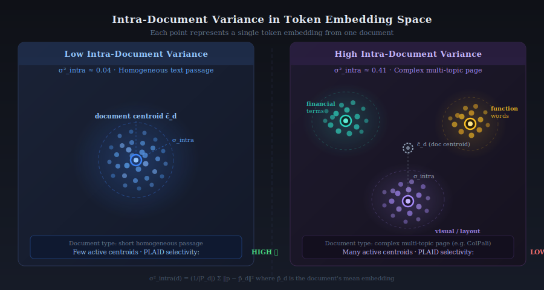
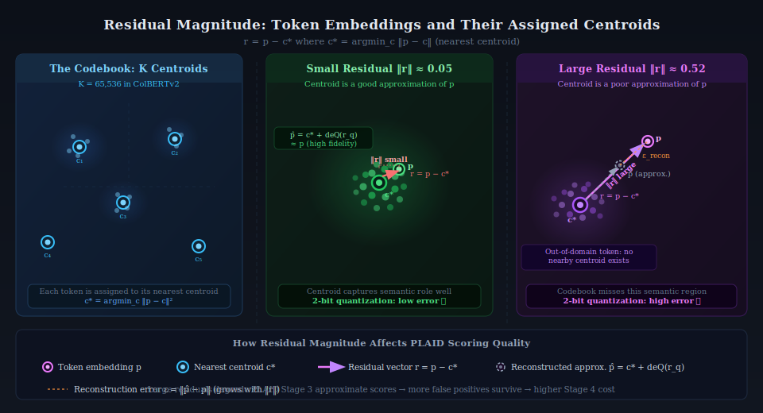
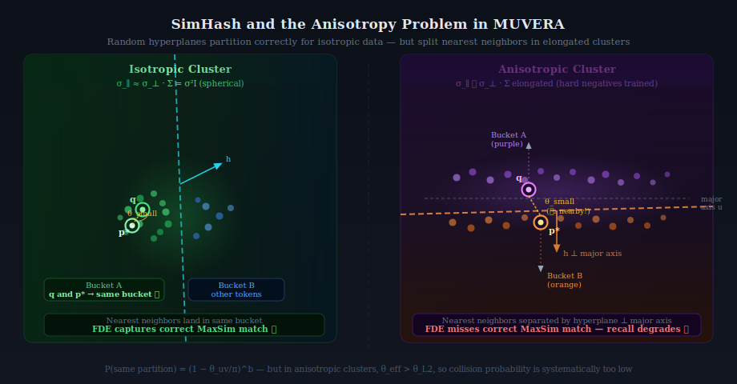
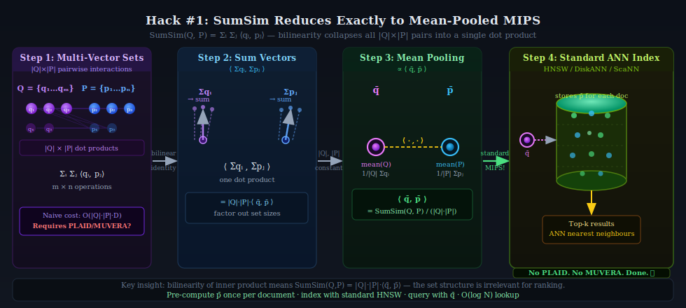
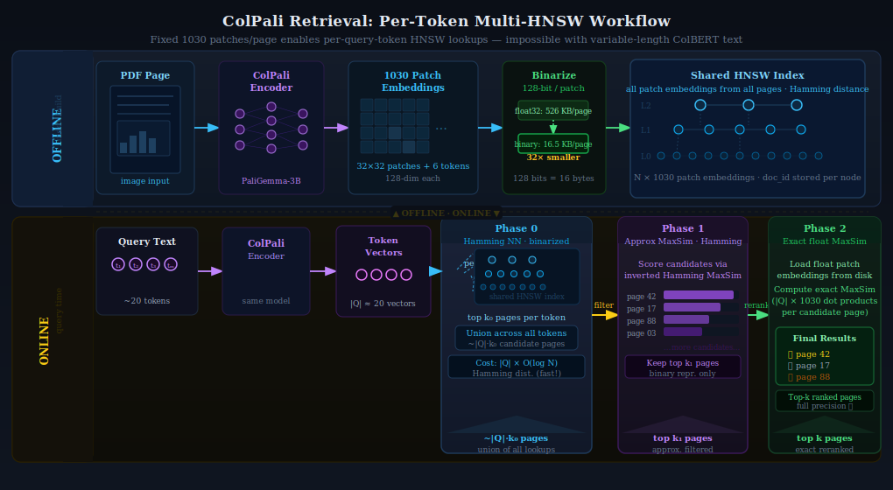

# When Geometry Is Everything: Multi-Vector Retrieval Beyond the MaxSim Monoculture

**Reading Time:** ~25 minutes

---

> **TL;DR:** The discourse around multi-vector retrieval has quietly calcified around a narrow set of assumptions: MaxSim scoring, ColBERT-style token distributions, and the claim that PLAID and MUVERA are the definitive solutions. But these algorithms are products of a *specific* dataset geometry and a *specific* similarity function—and when either changes, the math stops working in your favor. This post examines the full set-to-set similarity landscape, derives exactly why and when both PLAID and MUVERA break down, and shows that two ostensibly "hard" multi-vector problems—SumSim retrieval and ColPali at scale—have surprisingly simple solutions hiding in plain sight.

---

## Setting the Stage

In my [previous post on the economics of late interaction retrieval](https://sam-herman.github.io/blogs/database-as-innovator), I made the case that PLAID and MUVERA had fundamentally changed the cost calculus for multi-vector search, taking late interaction from a "hard no" to a "viable tradeoff" at production scale. I stand by that analysis—for the specific problem they were designed to solve.

But there's a subtlety worth unpacking. When we talk about "multi-vector retrieval," we're actually talking about a much larger family of problems than the ColBERT-MaxSim scenario that dominates the conversation. And when you zoom out from that specific case, some uncomfortable truths emerge:

1. **The most hyped algorithms are geometry-dependent**—they assume a very specific structure in how embeddings are distributed, and that structure is not universal
2. **The dominant similarity function (MaxSim) is one of many**—and the others don't always cooperate with PLAID or MUVERA's machinery
3. **Some "hard" multi-vector problems have embarrassingly simple solutions** that don't require any specialized infrastructure at all

The argument runs in three acts. First, we'll establish the two axes that determine which infrastructure choice is right for any given problem: the similarity function and the dataset geometry. Then we'll apply both axes to stress-test PLAID and MUVERA—not to dismiss them, but to be precise about where their assumptions hold and where they don't. Finally, we'll show that two "hard" multi-vector problems have simple closed-form solutions hiding inside those same assumptions, with immediate practical implications for how you architect retrieval systems today. If you want to skip ahead, the decision framework table at the end of the post is the practical output.

Let's dig in.

---

## The General Case of Set-to-Set Similarity

In the standard neural retrieval setting, you're doing **point-to-point** Maximum Inner Product Search (MIPS): a single query vector against a collection of single document vectors. The similarity is simply:

$$\text{sim}(q, d) = \langle q, d \rangle = \sum_{i=1}^D q_i d_i$$

This maps directly to an ANN index problem, and the entire ecosystem—HNSW, IVF, DiskANN, Product Quantization—is built to solve it efficiently.

Multi-vector retrieval generalizes this to **set-to-set** similarity: each entity is a *set* of embedding vectors $Q = \{q_1, \ldots, q_m\}$ and $P = \{p_1, \ldots, p_n\}$, and no single dot product tells you how similar they are. What you need is an *aggregation function* over all pairwise interactions.

Here's where things get interesting—because there are many such aggregation functions, and they're used in real applications:

**MaxSim (Chamfer Similarity):** The ColBERT standard. For each query token, find the best-matching document token; sum these maximal matches.

$$\text{MaxSim}(Q, P) = \sum_{i=1}^{|Q|} \max_{j=1}^{|P|} \langle q_i, p_j \rangle$$

This is the workhorse of late interaction retrieval. It allows fine-grained token alignment—each query token finds its best match independently—and it's asymmetric (the sum is over query tokens, not document tokens).

**SumSim (All-Pairs):** Sum all pairwise similarities.

$$\text{SumSim}(Q, P) = \sum_{i=1}^{|Q|} \sum_{j=1}^{|P|} \langle q_i, p_j \rangle$$

This treats every query-document token pair as equally relevant. It appears in cross-modal matching and group recommendation settings where you want aggregate affinity rather than fine-grained alignment.

**Top-K Sum:** For each query token, sum the top-$k$ (rather than just the maximum) document similarities.

$$\text{TopK}(Q, P) = \sum_{i=1}^{|Q|} \sum_{j \in \text{top-}k_P(q_i)} \langle q_i, p_j \rangle$$

This is a softer variant of MaxSim that rewards documents where multiple tokens strongly match each query token, not just one. Useful when entity sets have structured redundancy.

**Symmetric Chamfer:** Average of MaxSim in both directions—from query to document and from document to query.

$$\text{SymChamfer}(Q, P) = \frac{1}{2}\text{MaxSim}(Q, P) + \frac{1}{2}\text{MaxSim}(P, Q)$$

Used in some image-text matching settings where neither modality "anchors" the comparison.

Just this brief survey should give you pause. The literature discussing PLAID and MUVERA as solutions to "multi-vector retrieval" is almost entirely talking about **MaxSim**, and treating MaxSim as if it were synonymous with the problem itself. That's a significant conflation—and as we'll see, the algorithms break down in revealing ways when you change the scoring function or the data distribution.

---

## Dataset Geometry: What Are We Actually Indexing?

The second axis of analysis—equally important and equally underappreciated—is **dataset geometry**: the statistical structure of how document token embeddings are distributed in embedding space.

### Three Geometric Regimes

There are three primary distributional patterns to understand:

**Gaussian Isotropic:** Embeddings are drawn from a single distribution with uniform variance in all directions. This is the world that most ANN theory assumes—a "well-behaved" embedding space where random partitioning methods (like SimHash) work with provable guarantees.

$$\mathbf{v} \sim \mathcal{N}(\boldsymbol{\mu}, \sigma^2 \mathbf{I})$$

Here $\mathbf{v} \in \mathbb{R}^d$ is a single token embedding vector, $\boldsymbol{\mu} \in \mathbb{R}^d$ is the distribution mean (the centroid of the cloud), $\sigma^2$ is a single scalar variance applying equally in every direction, and $\mathbf{I}$ is the $d \times d$ identity matrix—meaning no direction in embedding space is preferred over any other.

**Gaussian Anisotropic:** Embeddings are still unimodal but have unequal variance across dimensions—stretched or compressed in specific directions. BERT's raw sentence embeddings, for instance, are famously anisotropic, with a few dominant principal components capturing most of the variance. This breaks the isotropy assumptions of many hashing-based methods.

$$\mathbf{v} \sim \mathcal{N}(\boldsymbol{\mu}, \boldsymbol{\Sigma}) \quad \text{where } \boldsymbol{\Sigma} \neq \sigma^2 \mathbf{I}$$

The key change is that the scalar $\sigma^2$ is replaced by a full covariance matrix $\boldsymbol{\Sigma} \in \mathbb{R}^{d \times d}$. When $\boldsymbol{\Sigma}$ has unequal eigenvalues, the distribution is stretched along some dimensions and compressed along others—producing an ellipsoidal cloud rather than a spherical one. The constraint $\boldsymbol{\Sigma} \neq \sigma^2 \mathbf{I}$ simply means the variances are not identical in all directions.

**Multi-Kernel Anisotropic:** Embeddings are drawn from a *mixture* of anisotropic Gaussians, where each mixture component ("kernel") corresponds to a semantic cluster, and each kernel can have its own covariance structure.

$$\mathbf{v} \sim \sum_{k=1}^K \pi_k \cdot \mathcal{N}(\boldsymbol{\mu}_k, \boldsymbol{\Sigma}_k) \quad \text{where } \sum_k \pi_k = 1$$

This extends the anisotropic case to $K$ distinct clusters. Each cluster $k$ has its own centroid $\boldsymbol{\mu}_k$ and its own covariance matrix $\boldsymbol{\Sigma}_k$ (so different clusters can have different shapes and orientations). The mixing weights $\pi_k \geq 0$ give the probability that a randomly drawn token embedding comes from cluster $k$; the constraint $\sum_k \pi_k = 1$ ensures these probabilities are well-formed. In practice, $\pi_k$ reflects how often a semantic category (financial terms, function words, visual elements) appears in the corpus.

This third regime is the realistic one for trained multi-vector embeddings like ColBERTv2. The token embeddings from a trained language model don't form a single Gaussian blob—they cluster by semantic meaning. All token embeddings for terms related to "financial instruments" cluster in one region of space; "biological processes" in another; function words ("the", "and", "is") in yet another. Each cluster has its own orientation (some are compact and round, others are elongated along specific axes corresponding to the semantic variation within that topic).

*Three distributional regimes: (left) Gaussian Isotropic—uniform variance in all directions; (center) Gaussian Anisotropic—stretched in specific directions; (right) Multi-Kernel Anisotropic—the realistic regime for trained ColBERT embeddings, with distinct semantic clusters each having their own shape and orientation. PLAID exploits this structure via its centroid codebook; MUVERA's SimHash assumes the first regime and struggles with the third.*

### Why Multi-Kernel Anisotropic? The Contrastive Training Connection

This isn't coincidence. The multi-kernel anisotropic structure is a *direct consequence* of how ColBERT and its family are trained using contrastive objectives.

In contrastive training, the model learns to pull positive query-document pairs together in embedding space while pushing negatives apart. The loss function that formalizes this is called **InfoNCE**—a name that carries meaning worth unpacking.

"NCE" stands for **Noise Contrastive Estimation**, a technique originally designed to train language models without computing an expensive softmax over a vocabulary of millions of words. The insight is to reframe the problem as binary classification: teach the model to distinguish *real* (signal) data from *noise* (randomly sampled negative) data, rather than predicting the exact right answer from all possible answers at once. This sidesteps the normalization constant that makes full softmax expensive. "Info" indicates that this particular loss is motivated as a lower bound on **mutual information** between representations—maximizing InfoNCE is equivalent to maximizing a variational lower bound on $I(\text{query}; \text{positive document})$. This information-theoretic grounding, introduced by van den Oord et al. (2018) in the context of sequential prediction, is what distinguishes InfoNCE from a plain cross-entropy or triplet loss.

The practical upshot: unlike standard cross-entropy (which needs a fixed, known label space) or MSE (which needs continuous target values), InfoNCE works wherever you can define positive/negative *pairs*—which is exactly the supervised retrieval setting. The loss takes the form:

$$\mathcal{L}_{\text{InfoNCE}} = -\log \frac{\exp(\text{sim}(q, p^+) / \tau)}{\sum_{p^- \in \mathcal{N}} \exp(\text{sim}(q, p^-) / \tau)}$$

where $q$ is a query embedding, $p^+$ is its positive (relevant) document embedding, $\mathcal{N}$ is a set of negative (non-relevant) documents, and $\tau$ is a temperature parameter. The numerator rewards similarity between $q$ and its true match; the denominator forces the model to simultaneously push down similarity to all negatives. Minimizing this loss is equivalent to making the positive pair score stand out from the crowd of negatives—directly shaping the relative geometry of the embedding space.

Under this objective, the geometry that emerges is predictable. The temperature $\tau$ acts as a "cluster tightness" parameter: lower temperature concentrates embeddings into tighter clusters; higher temperature allows more spread. The training process creates **equi-angular clusters**—distinct groups separated radially on the embedding hypersphere, with positive pairs clustered tightly within each group.

But the key insight for multi-vector retrieval is what happens *within* a document. A document about financial derivatives contains tokens spanning multiple semantic roles: financial terminology ("derivative," "swap," "yield"), syntactic function words ("the," "of," "which"), and contextual modifiers ("complex," "structured," "underlying"). Each of these semantic roles corresponds to a different region of the embedding space—a different kernel—and the tokens from a single document are distributed *across* these kernels.

This is the "multi-kernel" structure. And the "anisotropy" comes from the fact that within each kernel, the variance is not spherical. Hard negative mining—a standard component of ColBERT-style training—specifically shapes the within-kernel geometry in a way that needs careful explanation.

A **hard negative** is a document that the model currently finds *hard to reject*: it is *non-relevant* (a true negative by ground-truth label) but has an embedding that is *close to the query* in the current embedding space—similar wording, overlapping topic, or superficially matching structure. The "hard" refers to the model's difficulty of discrimination at training time, not to the documents being inherently similar in meaning. This contrasts with *easy negatives*—randomly sampled documents that are obviously unrelated and produce near-zero gradient, providing no useful learning signal.

Hard negative mining surfaces these ambiguous near-misses and forces the model to push them apart from positives. Because the negatives are semantically proximate to the query (same broad topic, similar surface form), this pressure acts *within a semantic neighborhood* rather than across the full embedding space. The result is directional: the model learns to stretch the representation along axes that discriminate fine-grained relevance within a topic cluster, while keeping inter-cluster distances large. This directional stretching within semantic clusters is precisely what produces elongated, non-spherical within-kernel covariance.

The hard-negative-augmented loss is:

$$\mathcal{L}_{\text{hard}} = -\log \frac{\exp(\text{sim}(q, p^+) / \tau)}{\exp(\text{sim}(q, p^+) / \tau) + \sum_{p^{\text{hard}} \in \mathcal{H}} \exp(\text{sim}(q, p^{\text{hard}}) / \tau)}$$

where $\mathcal{H}$ are hard negative passages—non-relevant documents that are superficially close to the query (retrieved by BM25 or an earlier model version, but labelled non-relevant). Because these hard negatives are drawn from the *same semantic neighborhood* as the query, the gradient of this loss explicitly pushes the model to create directional distinctions *within* semantic neighborhoods rather than between them—stretching the within-kernel distribution along the discrimination axis rather than compressing it uniformly.

### Quantifying the Geometry: Intra-Document Variance and Residuals

Before examining where PLAID and MUVERA break down—and before the two simplifications that are the practical payoff of this analysis—we need two concrete diagnostic quantities that connect geometry to algorithmic behavior.

**Intra-document variance** ($\sigma^2_{\text{intra}}$) measures how spread out a document's token embeddings are around their centroid:

$$\sigma^2_{\text{intra}}(d) = \frac{1}{|P_d|} \sum_{p \in P_d} \| p - \bar{p}_d \|^2 \quad \text{where } \bar{p}_d = \frac{1}{|P_d|} \sum_{p \in P_d} p$$

High $$\sigma^2_{\text{intra}}$$ means a document's tokens are spread across many semantic regions—many distinct kernels are activated per document. Low $\sigma^2_{\text{intra}}$ means tokens cluster tightly around a single centroid.

**Residual magnitude** ($\|r\|$) measures the reconstruction error after assigning each token to its nearest codebook centroid $c^*$:

$$r = p - c^*, \quad c^* = \underset{c \in \mathcal{C}}{\operatorname{argmin}} \|p - c\|^2$$

A small $\|r\|$ means the centroid codebook provides a good approximation; a large $\|r\|$ means the codebook is missing significant structure in the data.

These two quantities—$\sigma^2_{\text{intra}}$ and $\|r\|$—are the key indicators for predicting how well PLAID and MUVERA will perform on a given dataset. Let's see why.

*A document with **low intra-document variance** (left) has token embeddings tightly clustered around a single centroid—typical of a homogeneous short text passage. A document with **high intra-document variance** (right) has tokens spread across multiple distinct semantic kernels—typical of a complex multi-topic page like a ColPali image with mixed text, charts, and diagrams. PLAID's centroid pruning is highly selective in the left case; nearly ineffective in the right.*

---

## PLAID Under a Geometric Microscope

As I covered in detail in the [previous post](https://sam-herman.github.io/blogs/database-as-innovator), PLAID's insight is to use a centroid codebook to prune the candidate set early. The centroid inverted list tells you which documents have tokens assigned to which centroids, and you can eliminate documents whose centroids don't match query token embeddings—without ever reading the expensive full-residual representations from disk.

This is elegant, and it works beautifully for the ColBERTv2 MS MARCO case. But the efficiency of this pruning depends critically on the geometry.

### How Intra-Document Variance Determines Selectivity

PLAID's document selectivity—the fraction of documents eliminated by centroid pruning—depends on how many distinct centroids each document activates. Let $n_d$ be the number of *distinct* centroids across all tokens in document $d$. The probability that document $d$ survives an initial candidate generation sweep (i.e., has at least one token centroid matching a query centroid) is approximately:

$$P(\text{document } d \text{ survives}) \approx 1 - \left(1 - \frac{n_d}{C}\right)^{n_{\text{query}}}$$

where $C$ is the total codebook size (e.g., $C = 2^{16} = 65{,}536$ for ColBERTv2) and $n_{\text{query}}$ is the number of distinct centroids activated by the query (roughly equal to the number of query tokens, $\|Q\|$).

For the ColBERTv2 MS MARCO case, the centroid math works strongly in PLAID's favor. MS MARCO passages average roughly 55–80 tokens (with `doc_maxlen=180` as a ceiling); the default codebook size is $C = 2^{16} = 65{,}536$. Semantically similar tokens are assigned to the same centroid by design, so the number of distinct centroids activated per passage $n_d$ is substantially smaller than the token count—many function words, common phrases, and topically related terms cluster together. The PLAID paper (Santhanam et al., 2022) empirically validates this indirectly: centroid-only retrieval achieves >99% recall for top-$k$ passages within just $10k$ candidates across 8.8M passages on MS MARCO, which is only possible because the average passage activates a very small fraction of the 65,536-centroid codebook. If passages activated many hundreds of distinct centroids, the centroid-only stage would produce far more candidates to reach the same recall threshold.

Now consider what happens when $\sigma^2_{\text{intra}}$ is high—documents whose tokens span many different semantic regions. If $n_d$ grows substantially (approaching or exceeding several hundred distinct centroids per document), the survival probability above approaches 1 for nearly every document in the corpus. **PLAID's centroid pruning stage eliminates almost nothing.** You're left paying for Stage 4 exact scoring on the full candidate set, which collapses to the naive baseline.

This is not a hypothetical—it's a real concern for **ColPali** embeddings of complex document pages, where a single page may contain text in multiple languages, diagrams, charts, captions, and decorative elements, each mapping to different semantic kernels. The intra-document variance for a complex financial PDF page is expected to be substantially higher than for a homogeneous text passage.

### How the Residual Magnitude Determines Quantization Quality

The second failure mode for PLAID is more subtle but equally important: the quality of the 2-bit residual compression degrades as the residual magnitude grows.

Recall that ColBERTv2 compresses each token by storing the centroid ID plus a quantized residual $r_q$. The reconstruction error for a token $p$ assigned to centroid $c^*$ is:

$$\epsilon = \|p - (c^* + \text{dequantize}(r_q))\|$$

This error grows with $\|r\| = \|p - c^*\|$. When the residual is large—meaning the codebook centroids are a poor fit for the actual token distribution—aggressive 2-bit quantization introduces substantial reconstruction noise. The approximate MaxSim scores computed during PLAID's Stage 3 become less reliable, which in turn means **more false positives survive to Stage 4**, increasing the expensive exact-scoring burden.

*The **codebook** (left) divides embedding space into semantic regions, each with a centroid c*. When a token p falls near its assigned centroid (center panel), the residual r = p − c* is small and 2-bit quantization introduces minimal reconstruction error—p̂ ≈ p. When p is far from any centroid (right panel), the residual is large and deQuantization produces an approximation p̂ with significant drift—degrading the Stage 3 scoring fidelity in PLAID.*

Formally, the MaxSim approximation error can be bounded as:

$$|\text{MaxSim}(Q, P) - \widehat{\text{MaxSim}}(Q, P)| \leq |Q| \cdot \max_i \|\hat{q}_i - q_i\| \cdot \max_j \|p_j\|$$

where $\hat{q}_i$ is the reconstructed approximation of query token $q_i$. When residuals are large (poor codebook fit), these reconstruction errors compound, and the bound loosens—meaning the centroid interaction scores in Stage 3 are less trustworthy as proxies for exact MaxSim.

### How SumSim and Top-K Sum Break PLAID's Selectivity

This is where the set-to-set similarity function becomes a first-class concern.

PLAID's Stage 2 (centroid pruning) works by reasoning about MaxSim: if a centroid $c_k$ has low similarity to *all* query tokens, it cannot contribute to the MaxSim score, so it can be safely pruned. The pruning logic is:

$$\text{Prune centroid } c_k \text{ if } \max_{i} \langle q_i, c_k \rangle < \theta$$

This is sound for MaxSim because the max operation means that a centroid that doesn't strongly match *any* query token can never be the "winning match" for any query token. The contribution of centroid $c_k$ to the final score is bounded by $\max_i \langle q_i, c_k \rangle$.

Now replace MaxSim with **SumSim**:

$$\text{SumSim}(Q, P) = \sum_{i} \sum_{j} \langle q_i, p_j \rangle$$

Under SumSim, every document token contributes to every query token's score—there's no "winner takes all." A centroid with low similarity to all query tokens individually may still be part of a document that has high total aggregate similarity. The safe pruning condition for MaxSim no longer holds. In fact, **any centroid with a non-zero dot product with any query token must be considered**, which in practice means centroid pruning eliminates essentially nothing.

The same argument applies to **Top-K Sum**, where the contribution of a document token is capped at being in the top-$k$ matches per query token rather than strictly the maximum. The mathematical boundary on the residual's contribution to the aggregate score is looser:

$$|\text{contribution}(c_k, Q)| \leq |Q| \cdot k \cdot \|\langle Q, c_k \rangle\|_\infty$$

This larger bound means PLAID's pruning threshold must be set proportionally lower to remain safe, which in turn means fewer candidates get pruned. For large $k$, the advantage essentially vanishes.

> **The Bottom Line for PLAID:** PLAID is purpose-built for MaxSim scoring on multi-kernel anisotropic data where intra-document variance is moderate and residuals are small. When either condition fails—high variance, large residuals, or a non-MaxSim similarity function—the algorithm's guarantees weaken and its practical efficiency degrades.

---

## MUVERA Under a Geometric Microscope

MUVERA's approach is mathematically different from PLAID's: rather than building a custom inverted index for multi-vector data, it transforms multi-vector sets into fixed-dimensional vectors (FDEs) via SimHash partitioning, enabling standard single-vector MIPS. The theoretical promise is an $\epsilon$-approximation guarantee for the Chamfer similarity (MaxSim).

But the theory comes with an assumption baked in: that the SimHash partitioning correctly places nearby vectors into the same bucket. Let's examine what happens when this assumption breaks down.

### SimHash and the Anisotropy Problem

SimHash partitions $\mathbb{R}^d$ using $b$ random hyperplanes $\{h_1, \ldots, h_b\}$, each drawn independently and uniformly from the sphere $\mathbb{S}^{d-1}$. Two vectors $u, v$ are assigned to the same partition if $\text{sign}(\langle h_l, u \rangle) = \text{sign}(\langle h_l, v \rangle)$ for all $l = 1, \ldots, b$.

The probability that $u$ and $v$ share a partition is exactly:

$$P(\text{same partition}) = \left(1 - \frac{\theta_{uv}}{\pi}\right)^b$$

where $\theta_{uv} = \arccos\left(\frac{\langle u, v \rangle}{\|u\|\|v\|}\right)$ is the angle between them. This monotonically decreases in $\theta_{uv}$ and in $b$—as vectors become more similar (smaller angle) and as you use fewer hyperplanes, collision probability increases.

For **isotropic data**, random hyperplanes are an excellent partitioning strategy because no direction is privileged; the hyperplanes respect the underlying geometry.

For **anisotropic data**, the situation is different. Consider a kernel (semantic cluster) with a covariance matrix $\boldsymbol{\Sigma}_k$ that is elongated—much larger variance along a specific direction $\mathbf{u}$ than orthogonal directions:

$$\boldsymbol{\Sigma}_k = \sigma_\parallel^2 \mathbf{u}\mathbf{u}^\top + \sigma_\perp^2 (\mathbf{I} - \mathbf{u}\mathbf{u}^\top), \quad \sigma_\parallel \gg \sigma_\perp$$

Within this kernel, two vectors $p_1, p_2$ that are nearby in $\ell_2$ distance may have a relatively large angular separation $\theta_{p_1 p_2}$, because the elongation along $\mathbf{u}$ produces many pairs with large directional displacement but small absolute distance.

Now a random hyperplane $h$ that is *perpendicular to* $\mathbf{u}$—which is not unlikely, given random sampling—will **split the cluster along its major axis**, separating $p_1$ and $p_2$ into different buckets despite their proximity. This directly reduces the probability that a query token and its best-matching document token share a SimHash partition.

The practical consequence: in a multi-kernel anisotropic space, the effective $P(\text{same partition})$ for true nearest-neighbor pairs is substantially lower than the theoretical prediction from cosine similarity alone. This means MUVERA's FDE dot product systematically underestimates Chamfer similarity, increasing recall error. *(To my knowledge, this degradation has not been directly quantified on ColBERT-family embeddings as a function of within-kernel anisotropy—it would be a clean empirical contribution.)*

*SimHash failure with anisotropic data. Left: in an isotropic (spherical) cluster, a random hyperplane is unlikely to separate nearby vectors q and p*—they land in the same bucket and the FDE captures the correct match. Right: in an elongated anisotropic cluster trained with hard negatives, a hyperplane perpendicular to the major axis splits q and p* into different buckets despite their small ℓ₂ distance. The effective angular separation θ_eff inflated by anisotropy is what drives the collision probability down—this is the root cause of MUVERA's recall degradation on ColBERT-family embeddings.*

### The Over-Partitioning Problem

There's a second failure mode for MUVERA that operates in the opposite direction: using too many hash bits $b$ (too many partitions) in an anisotropic setting.

In MUVERA's FDE construction, the total number of partitions is $K = 2^b$. The FDE dimension grows as $r \times K \times d_{\text{proj}}$, so practitioners balance partitioning fineness against FDE size. But increasing $b$ has a subtle secondary effect: with finer partitioning on anisotropic data, the probability that the *same* pair of similar vectors land in the same bucket decreases faster than on isotropic data.

Formally, for an anisotropic cluster with effective angle $\theta_{\text{eff}} > \theta_{uv}$ (the "apparent" angular separation inflated by anisotropy), the collision probability becomes:

$$P(\text{correct collision}) \approx \left(1 - \frac{\theta_{\text{eff}}}{\pi}\right)^b$$

which decays exponentially in $b$. As $b$ grows, the effective recall of MUVERA's candidate generation phase degrades—not from the FDE being uninformative, but from the partitioning not placing nearest neighbors into the same bucket reliably.

There is therefore a trade-off: too few partitions ($b$ small) gives coarse FDEs with poor discrimination between non-relevant documents; too many partitions ($b$ large) causes correct nearest-neighbor pairs to be separated, reducing recall. For isotropic data, this trade-off has a natural sweet spot that's relatively easy to tune. For anisotropic data—and especially multi-kernel anisotropic data—the window is narrower and the optimum shifts in ways that depend on the specific covariance structure of each kernel.

> **The Bottom Line for MUVERA:** MUVERA's theoretical guarantees assume that SimHash correctly partitions the embedding space such that nearest neighbors share buckets with high probability. In multi-kernel anisotropic spaces—which is what trained ColBERT-family models produce—this assumption is violated for elongated within-kernel distributions. The failure is exacerbated by increasing the number of partitions.

---

## Hacks: Where Elaborate Infrastructure Isn't Needed

Now for the part I find genuinely exciting—two cases where the "hard" multi-vector problem turns out to be trivially reducible to a problem we already know how to solve.

### Hack #1: SumSim Is Just Mean-Pooled MIPS

At first glance, SumSim seems to require multi-vector infrastructure: you have sets $Q$ and $P$, and you need to sum over all $\|Q\| \times \|P\|$ pairwise dot products. Surely this requires something like PLAID or MUVERA?

Let's do the algebra:

$$\text{SumSim}(Q, P) = \sum_{i=1}^{|Q|} \sum_{j=1}^{|P|} \langle q_i, p_j \rangle$$

By the bilinearity of the inner product:

$$= \left\langle \sum_{i=1}^{|Q|} q_i,\ \sum_{j=1}^{|P|} p_j \right\rangle$$

$$= |Q| \cdot |P| \cdot \left\langle \frac{1}{|Q|}\sum_{i=1}^{|Q|} q_i,\ \frac{1}{|P|}\sum_{j=1}^{|P|} p_j \right\rangle$$

$$= |Q| \cdot |P| \cdot \langle \bar{q}, \bar{p} \rangle$$

where $\bar{q}$ and $\bar{p}$ are the **mean-pooled** embeddings of the query and document sets, respectively.

When comparing documents for a fixed query, $\|Q\|$ is constant and can be dropped. If document sets also have fixed size $\|P\|$ (as with ColPali's 1030 patches), the prefactor is a constant. We are left with:

$$\text{SumSim}(Q, P) \propto \langle \bar{q}, \bar{p} \rangle$$

**This is a standard MIPS problem.** You can compute mean-pooled representations offline for every document, index them in any standard ANN system (HNSW, DiskANN, ScaNN), and retrieve them with a single mean-pooled query vector. No PLAID. No MUVERA. No custom infrastructure whatsoever.

This has immediate practical implications. Any retrieval system where the scoring function is SumSim—aggregate affinity, group recommendation, cross-modal matching with all-pair scoring—does not need multi-vector retrieval infrastructure. Mean pooling and a standard vector database is the correct solution, and it's orders of magnitude cheaper.

The mathematical equivalence also provides a clear intuition for when SumSim is the right choice: when every token-to-token interaction is genuinely informative, with no winner-takes-all dynamics. For dense, topic-homogeneous queries and documents, this can be reasonable. For queries where only a few tokens carry the semantic signal—typical in information retrieval—MaxSim's "find the best match" semantics are more appropriate.

*The four-step reduction: (1) SumSim requires |Q|×|P| pairwise dot products—superficially a multi-vector problem; (2) bilinearity of the inner product collapses these into a single dot product of summed vectors; (3) factoring out the set sizes gives the mean-pooled dot product ⟨q̄, p̄⟩ up to a constant; (4) this is a standard MIPS problem—index p̄ per document in any ANN system and query with q̄. No PLAID. No MUVERA. O(log N) lookup.*

> **Practical implication:** If you're using SumSim and running PLAID or MUVERA, you're paying for infrastructure you don't need. Mean-pool your embeddings, use a standard HNSW index, and call it done.

### Hack #2: ColPali Doesn't Need What ColBERT Needs

ColPali generates exactly **1030 patch embeddings per page** (a fixed 32×32 grid of 1024 image patches plus 6 instruction text tokens), each projected into a 128-dimensional space. This fixed structure is fundamentally different from ColBERTv2 text embeddings, where document length varies—a 20-token passage might have 20 embeddings; a 300-token passage has 300.

This variability in ColBERT text is precisely what makes indexing challenging. You can't pre-aggregate to a fixed representation because you don't know how many tokens each document will have, and the token count itself is semantically meaningful (document length affects the MaxSim score normalization).

With ColPali, this problem evaporates. Every page has exactly 1030 patches. This opens up indexing strategies that simply aren't available for variable-length ColBERT:

**The Vespa Approach: Per-Token Nearest Neighbor Search.** Vespa's production ColPali implementation indexes each patch embedding as an individual vector in an HNSW index, then at query time, issues one `nearestNeighbor` query per query token—retrieving the $k$ closest pages per query token using binary (Hamming) embeddings as a first pass. This multi-phase pipeline looks like:

1. **Phase 0 (pre-filtering):** For each of $\|Q\|$ query tokens, retrieve $k_0$ nearest page-patches using Hamming distance on binarized embeddings. Union the corresponding pages.
2. **Phase 1 (approximate MaxSim):** Score surviving pages with approximate MaxSim using inverted Hamming distance. Keep top $k_1$ pages.
3. **Phase 2 (exact MaxSim):** Rerank the top $k_1$ pages using full-precision float MaxSim.

With binarized patch embeddings (128 bits = 16 bytes per patch, a 32× compression from float32), the per-query cost scales as $\|Q\| \times k_0 \times O(\log N)$ for the HNSW lookups—very manageable.

*The complete ColPali retrieval pipeline. Offline: pages are encoded into 1030 patch embeddings each, binarized to 16 bytes/patch (32× compression), and all patches from all pages are stored in a single shared HNSW index keyed by Hamming distance. Online: each query token independently issues a nearest-neighbor lookup against the shared index (Phase 0), the resulting page sets are unioned, scored with approximate Hamming-based MaxSim (Phase 1), and the top candidates are re-ranked with exact float MaxSim loaded from disk (Phase 2). The fixed patch count of 1030 per page is what makes the per-token HNSW strategy tractable—variable-length ColBERT text cannot exploit this structure.*

**The Fixed-Centroid Alternative.** Because the number of patches per document is fixed at 1030, you can pre-cluster each document's patches into a fixed number of centroids ($C_d$, say 10-30) using k-means, and index only those centroids. This creates a compact two-level structure:

- **Level 1:** $C_d$ centroids per document in a standard HNSW index (fast candidate generation)
- **Level 2:** Full 1030 patch embeddings per document on disk (for exact MaxSim scoring of top candidates)

Candidate generation now requires $O(\|Q\| \times \log(N \times C_d))$ operations—proportional to the number of query tokens and the log-size of the centroid index. Exact MaxSim is only computed for the top-$k$ candidates, involving $\|Q\| \times 1030$ dot products per candidate.

This is essentially the PLAID architecture—but with a key difference. Because every document has exactly 1030 patches (not a variable number), the codebook can be constructed per-document rather than globally, and the indexing structure can leverage the fixed cardinality to avoid the centroid-ID allocation overhead that PLAID requires at corpus scale.

**The Cost Comparison.** For ColPali at 1 billion pages, with binarized patch embeddings:

| Configuration | Storage per Page | 1B Pages Storage | Phase 0 Recall |
|---|---|---|---|
| ColPali float32 | 1030 × 128 × 4 B = 526 KB | ~526 TB | 100% |
| ColPali bfloat16 | 1030 × 128 × 2 B = 263 KB | ~263 TB | ~99% |
| ColPali binarized | 1030 × 16 B = 16.5 KB | ~16.5 TB | ~94% (recovered in phase 2) |
| Centroid index (30 centroids, bfloat16) | 30 × 128 × 2 B = 7.7 KB | ~7.7 TB | variable |

The binarized approach is the practical winner: 32× compression with minimal recall loss (binarization results in a small drop on DocVQA, recoverable in the float re-ranking phase), and compatibility with Hamming-distance HNSW which is natively supported in systems like Vespa.

> **Practical implication:** ColPali's fixed patch count of 1030 per page is a gift, not a constraint. It enables indexing strategies based on fixed-cardinality multi-vector representations that don't exist for variable-length ColBERT text, and makes brute-force MaxSim feasible at smaller scales (tens of millions of pages) without any specialized infrastructure.

---

## Pulling It Together: A Decision Framework

The taxonomy that emerges from this analysis is more nuanced than "use PLAID for late interaction" or "use MUVERA if you want standard infrastructure." The right architecture depends on *both* the similarity function and the dataset geometry.

| Similarity Function | Data Geometry | Recommended Approach |
|---|---|---|
| **SumSim** | Any | Mean-pool → standard HNSW. No multi-vector infrastructure needed. |
| **MaxSim (Chamfer)** | Multi-kernel anisotropic, moderate $\sigma^2_{\text{intra}}$ | PLAID (purpose-built; proven at MS MARCO scale) |
| **MaxSim (Chamfer)** | Multi-kernel anisotropic, high $\sigma^2_{\text{intra}}$ | PLAID with larger codebook; verify stage-2 selectivity empirically |
| **MaxSim (Chamfer)** | Any | MUVERA (standard MIPS infra + re-rank)—but validate recall on your data; tune $b$ carefully for anisotropic data |
| **Top-K Sum** | Multi-kernel anisotropic | Custom pipeline; PLAID pruning doesn't apply directly; consider MUVERA with adjusted FDE aggregation |
| **MaxSim (ColPali)** | High intra-doc variance visual data | Vespa-style per-token HNSW + binarization, or fixed-centroid approach |
| **MaxSim (ColPali)** | Small corpora (<10M pages) | Brute-force float MaxSim (1030 patches × N pages × Q tokens) is feasible at moderate scale |

The common thread in the "hacks": when the structure of your problem is more constrained than the general case PLAID/MUVERA were designed for, simpler solutions often dominate.

---

## Implications for Embedding Model Design

The geometry insights above have a direct design implication that's often overlooked: you can *train* for a geometry that's more indexing-friendly.

In the [previous post on domain adaptation](https://sam-herman.github.io/blogs/embedding-adaptation-for-domain-specific), we discussed how domain-specific fine-tuning reshapes the embedding space. The same techniques that tune vocabulary coverage also reshape the geometric structure—and we can be deliberate about it.

For applications where you know the similarity function is MaxSim (the ColBERT case), moderate intra-document variance is desirable: enough spread to achieve good recall in PLAID's centroid lookup, but compact enough to make Stage 2 pruning effective. You can steer this via the training objective.

One approach is to add an **intra-document variance regularizer** to the contrastive loss:

$$\mathcal{L}_{\text{total}} = \mathcal{L}_{\text{InfoNCE}} + \lambda \cdot \mathcal{L}_{\text{variance}}$$

where:

$$\mathcal{L}_{\text{variance}} = \left| \frac{1}{|\mathcal{D}|} \sum_{d \in \mathcal{D}} \sigma^2_{\text{intra}}(d) - \sigma^2_{\text{target}} \right|^2$$

By setting $\sigma^2_{\text{target}}$ to a value that empirically yields good PLAID selectivity on your codebook size, you bake indexing efficiency into the embedding model itself.

Similarly, for applications using MUVERA in anisotropic spaces, you might regularize for *lower* intra-kernel anisotropy—encouraging rounder cluster shapes that play better with random hyperplane partitioning:

$$\mathcal{L}_{\text{isotropy}} = \sum_{k} \left\| \hat{\boldsymbol{\Sigma}}_k - \sigma^2 \mathbf{I} \right\|_F$$

This is, admittedly, more involved—it requires estimating per-cluster covariance during training, which is non-trivial. But the point stands: embedding model design and indexing infrastructure aren't independent choices. The geometry your model learns directly determines how well your index performs, and you have more control over that geometry than is commonly appreciated.

---

## A Note on What This Doesn't Change

Before closing, it's worth being precise about what this analysis does and doesn't refute.

**PLAID and MUVERA are genuinely impressive.** For the ColBERT-MaxSim-on-MS MARCO problem they were designed for, they represent major advances, and the economic analysis from the previous post holds: late interaction is now viable at scales where it previously wasn't. Nothing in this post undercuts that.

**MaxSim on ColBERT-style text data is the dominant use case**, and on that use case, PLAID works well. The failure modes I've described are real but they're edge cases for text retrieval—they become primary concerns for multi-modal retrieval (ColPali), non-standard similarity functions, or domain-specific data with unusual geometric properties.

**The "hacks" are not always hacks.** SumSim may genuinely be the right scoring function for some applications—my point is only that if it's your function, you don't need specialized infrastructure. And ColPali's fixed patch structure is a deliberate design choice with real advantages; its indexing simplicity is one of those advantages.

What I hope this analysis provides is a more precise vocabulary for thinking about multi-vector retrieval: similarity function and dataset geometry as the two fundamental axes, with infrastructure choices following from them rather than preceding them.

---

## Looking Forward

The questions this analysis raises are, I think, more interesting than the answers it provides:

**Can we build geometry-aware hashing for multi-vector retrieval?** Instead of random hyperplanes, partitioning based on the actual covariance structure of token embeddings—something like k-means-based LSH—would be much more robust to anisotropic data. PLAID's centroid codebook is already a step in this direction; the question is whether a similar idea can be incorporated into MUVERA's FDE construction.

**What's the right similarity function for visual retrieval?** ColPali uses MaxSim because ColBERT used MaxSim—but is that right for image patches? A patch that depicts a chart legend might be uniformly relevant to many query tokens, which is a more SumSim-like interaction. Benchmarking different similarity functions on visual retrieval tasks seems underexplored.

**How does retrieval geometry change with model scale?** Larger VLMs (ColQwen, ColGemma) likely produce patch embeddings with different geometric properties than PaliGemma-based ColPali. Understanding how geometry scales with model capacity could inform both model design and infrastructure choices.

**Can training objectives directly optimize for indexing efficiency?** The variance regularization idea above is speculative, but the general question—can we train embeddings that are simultaneously high-quality for retrieval and favorable for ANN indexing—seems worth pursuing as a joint optimization problem.

These are the questions I'm watching closely as multi-vector retrieval continues to mature. The one thing I'm confident of: the conversation will be richer when it's grounded in geometry and scoring functions, not just benchmark numbers on MS MARCO.

---

*As always, the analysis here represents my current thinking based on the public literature and my own experimentation. If you have empirical results that confirm or challenge any of these geometric intuitions, I'd love to hear about it.*

**Previous in the series:** [When the Database Becomes the Bottleneck: The Economics of Vector Retrieval and the Technologies That Change the Math](https://sam-herman.github.io/blogs/database-as-innovator)

**Previous:** [The Reality of Vector Quantization: A Deep Dive into Product Quantization Trade-offs](https://sam-herman.github.io/blogs/the-reality-of-vector-quantization)

---

## References

1. **Santhanam, K., Khattab, O., Potts, C., & Zaharia, M.** (2022). PLAID: An Efficient Engine for Late Interaction Retrieval. *Proceedings of the 31st ACM International Conference on Information and Knowledge Management (CIKM '22)*. [arXiv:2205.09707](https://arxiv.org/abs/2205.09707)

2. **Dhulipala, L., Jayaram, R., Knittel, A., Liu, J., & Mirrokni, V.** (2024). MUVERA: Multi-Vector Retrieval via Fixed Dimensional Encodings. *Advances in Neural Information Processing Systems 37 (NeurIPS 2024)*. [arXiv:2405.19504](https://arxiv.org/abs/2405.19504)

3. **Santhanam, K., Khattab, O., Saad-Falcon, J., Potts, C., & Zaharia, M.** (2021). ColBERTv2: Effective and Efficient Retrieval via Lightweight Late Interaction. *arXiv:2112.01488*.

4. **Faysse, M., et al.** (2024). ColPali: Efficient Document Retrieval with Vision Language Models. *arXiv:2407.01449*.

5. **van den Oord, A., Li, Y., & Vinyals, O.** (2018). Representation Learning with Contrastive Predictive Coding. *arXiv:1807.03748*.

6. **Wang, F., & Liu, H.** (2021). Understanding the Behaviour of Contrastive Loss. *Proceedings of the IEEE/CVF Conference on Computer Vision and Pattern Recognition (CVPR)*, 2495–2504.

7. **Rusak, E., et al.** (2024). AnInfoNCE: Anisotropic Contrastive Learning. *ICLR Workshop on High-dimensional Learning Dynamics*.

8. **Charikar, M. S.** (2002). Similarity Estimation Techniques from Rounding Algorithms. *Proceedings of the Thirty-Fourth Annual ACM Symposium on Theory of Computing*, 380–388. (SimHash / LSH for cosine similarity)

9. **Malkov, Y. A., & Yashunin, D. A.** (2018). Efficient and Robust Approximate Nearest Neighbor Search Using Hierarchical Navigable Small World Graphs. *IEEE Transactions on Pattern Analysis and Machine Intelligence*, 42(4), 824–836.

10. **Mathisen, J., et al.** (2024). Scaling ColPali to Billions of PDFs with Vespa. *Vespa Blog*. [blog.vespa.ai/scaling-colpali-to-billions](https://blog.vespa.ai/scaling-colpali-to-billions/)

11. **Herman, S.** (2025). When the Database Becomes the Bottleneck: The Economics of Vector Retrieval and the Technologies That Change the Math. [Blog post](https://sam-herman.github.io/blogs/database-as-innovator)

12. **Herman, S.** (2025). Teaching Embedding Models New Words: A Deep Dive into Domain Adaptation. [Blog post](https://sam-herman.github.io/blogs/embedding-adaptation-for-domain-specific)

13. **Herman, S.** (2025). The Reality of Vector Quantization: A Deep Dive into Product Quantization Trade-offs. [Blog post](https://sam-herman.github.io/blogs/the-reality-of-vector-quantization)