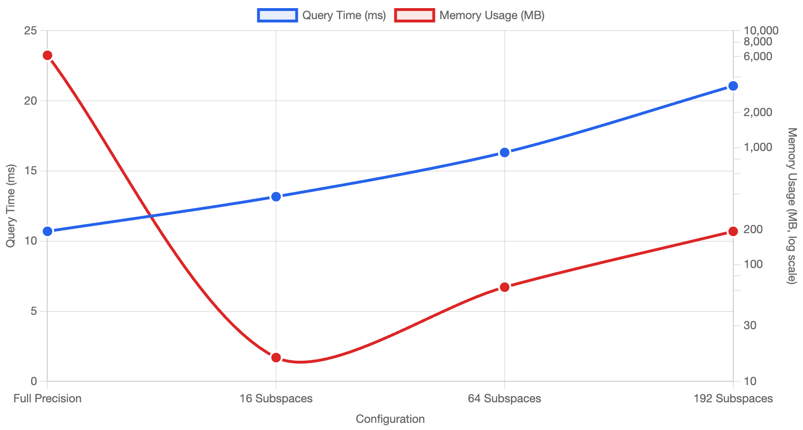
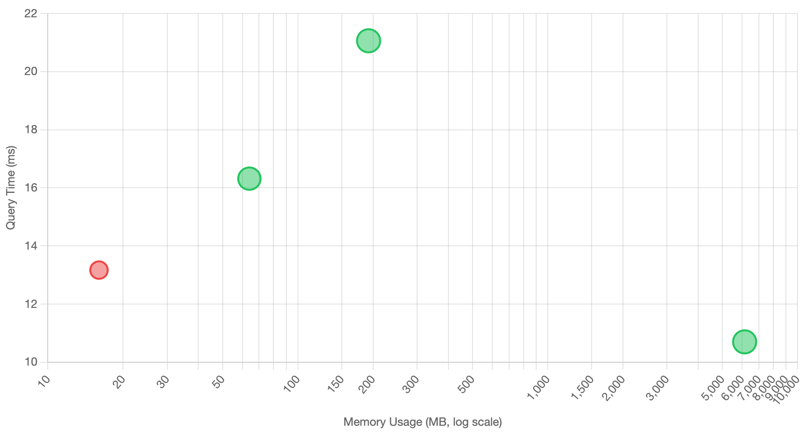

# The Reality of Vector Quantization: Does Product Quantization Deliver on Its Promises?

*Part 2 of the KNN series exploring practical challenges in building scalable vector databases*

In [KNN Part I](gpu-for-vector-search.md) we spent quite a bit of time discussing CPU acceleration and optimization for large-scale KNN computation.
However, when building production vector databases (especially around 1B vectors), the biggest performance bottleneck you are likely to encounter isn't computation—it's disk IO.
Dense vector search has become the backbone of semantic retrieval, but as embedding dimensions grow from 768 to 1536+ and datasets scale to billions of vectors, we hit a fundamental problem: **The vector dataset doesn't fit in RAM**.
Loading the vector dataset into RAM is a pre-requisite for any future vector distance computations that will follow for KNN purposes.

## The Memory Wall Problem

Consider the storage requirements for Float32 vectors using the formula: `S = N × D × B`

- `S` = Total storage (bytes)
- `N` = Number of vectors
- `D` = Dimensions per vector
- `B` = Bytes per dimension (4 for Float32)

**Storage Requirements for Float32 Vectors**

| Dimensions | Memory/Vector | 1M Vectors | 1B Vectors | AWS RAM Cost/Month* |
|------------|---------------|------------|-------------|-------------------|
| 768        | 3 KB          | 3 GB       | 3 TB        | **$19,929**       |
| 1536       | 6 KB          | 6 GB       | 6 TB        | **$39,858**       |

*AWS u-3tb1/u-6tb1 High Memory instances (On-Demand pricing, US East)

With modern embeddings typically using 768-1536 dimensions, billion-vector deployments require terabytes of RAM—economically prohibitive for most applications.

**This is where quantization enters the picture.** But as we'll discover, the reality of quantization techniques like Product Quantization is far more nuanced than their promises suggest.

## The Disk I/O Performance Cliff

One apparent solution is **memory mapping**—a technique that allows applications to access disk-stored data as if it were in RAM by mapping file contents directly into the process's virtual address space. This seems attractive because it lets you work with datasets larger than physical memory without explicit I/O management.

However, memory mapping is a superficial solution for vector KNN workloads. When the vector dataset can't fully fit in RAM, the operating system pages them from the disk, and each vector comparison triggers expensive disk reads. In vector indices this will also trigger random disk access, which creates severe performance penalties:

**Storage Access Latency Comparison**

| Technology | Random Access Latency | vs RAM | Use Case |
|------------|----------------------|--------|----------|
| DDR4/DDR5 RAM | ~100 ns | 1× | Active datasets |
| NVMe SSD | ~100-200 μs | **1,000-2,000× slower** | High-performance storage |
| SATA SSD | ~500 μs | **5,000× slower** | General storage |
| Traditional HDD | ~5-10 ms | **50,000-100,000× slower** | Cold storage |

This performance gap explains why algorithms like DiskANN rely heavily on keeping working sets in memory during index construction, where thousands of distance computations occur per new node insertion.

## Understanding Product Quantization

In jVector we are addressing this issue for large index construction by introducing a quantization technique widely known as Product Quantization (PQ).
PQ addresses the memory problem through a divide-and-conquer approach. Instead of quantizing entire high-dimensional vectors, PQ splits each vector into smaller subvectors and quantizes each subspace independently.

**How PQ Works:**
1. **Partition**: Split D-dimensional vectors into M subspaces of d = D/M dimensions each
2. **Cluster**: Run k-means clustering on each subspace to create K centroids (codebook)
3. **Encode**: Replace each subvector with the index of its nearest centroid
4. **Compress**: Store only the centroid indices (typically 8 bits = 256 possible centroids per subspace)

**Key Parameters:**
- **M (subspaces)**: Number of partitions. More subspaces = better quality but less compression
- **K (centroids)**: Codebook size per subspace. Typically K=256 (8 bits) for practical implementations
- **Compression ratio**: `(D × 32 bits) ÷ (M × 8 bits) = 4D/M`

For our 1536-dimensional examples:
- **M=16**: Each subspace has 96 dimensions, compression ratio = 384:1
- **M=192**: Each subspace has 8 dimensions, compression ratio = 32:1

The fundamental trade-off: fewer subspaces yield better compression but worse approximation quality.

## Product Quantization: The Compression Promise

Product Quantization (PQ) emerged as a solution, offering three compelling advantages:

### 1. Extreme Compression Ratios

PQ achieves compression ratios impossible with other techniques. For 1536-dimensional vectors using 16 subspaces:

**Compression: (1536 × 4 bytes) ÷ 16 bytes = 384:1**

**PQ Storage Efficiency (1536D, 16 subspaces)**

| Dataset Size | Full Precision | PQ Compressed | Space Saved | Ratio |
|--------------|---------------|---------------|-------------|-------|
| 1M vectors   | 6 GB          | 16 MB         | 5.98 GB     | 384:1 |
| 100M vectors | 600 GB        | 1.6 GB        | 598.4 GB    | 384:1 |
| 1B vectors   | 6 TB          | 16 GB         | 5.98 TB     | 384:1 |

### 2. In-Memory Distance Computation

Compressed vectors fit in RAM, enabling in-memory distance calculations and eliminating expensive disk I/O during search and index construction.

### 3. Computational Acceleration Through Memoization

PQ's finite centroid space (typically K=256 per subspace) enables precomputation of all possible centroid-to-centroid distances. With 16 subspaces, this requires storing only:

```
Memory = 16 × (256²/2) × 4 bytes ≈ 8 MB
```

This transforms distance computation from O(d) floating-point operations to O(1) memory lookups per subspace.

## Benchmark Results: The Promise Realized

Our jVector benchmarks on 1536-dimensional vectors show dramatic performance improvements:

**Distance Computation Performance**

| Subspaces | Avg Latency (μs) | Speedup vs Full Precision |
|-----------|------------------|---------------------------|
| 0 (Full)  | 375,719 ± 24,498 | Baseline                  |
| 16        | 13,751 ± 321     | **27.3× faster**          |
| 64        | 40,927 ± 541     | 9.2× faster               |
| 192       | 133,815 ± 6,739  | 2.8× faster               |

**Index Construction Acceleration**

| Configuration | Construction Time | Improvement |
|---------------|------------------|-------------|
| Full Precision (100K vectors, 1536D) | 38.4 ± 2.4 seconds | Baseline |
| PQ Compressed (16 subspaces) | 4.3 ± 0.8 seconds | **9.0× faster** |

## The Reality Check: Quality vs Performance Trade-offs

However, aggressive compression comes with severe quality degradation:

**Recall Degradation Analysis (100K vectors, k=50)**

| PQ Subspaces | Configuration | Recall@50 | Quality Loss |
|--------------|---------------|-----------|--------------|
| 0 (Full)     | No quantization | 1.00 | Baseline |
| 16           | 96 dims/subspace | 0.10 | **90% degradation** |
| 32           | 48 dims/subspace | 0.10 | **90% degradation** |
| 64           | 24 dims/subspace | 0.20 | **80% degradation** |
| 96           | 16 dims/subspace | 0.40 | **60% degradation** |
| 192          | 8 dims/subspace | 0.80 | **20% degradation** |

The sweet spot for computational performance (16 subspaces) produces practically unusable results with only 10% recall.

## The Re-ranking Reality

To achieve acceptable recall, we must increase the **overquery factor**—a multiplier that determines how many extra candidates to retrieve during the initial (fast) quantized search phase before re-ranking with full-precision vectors.

**Overquery Factor Explained:**
- **Factor = 1**: Retrieve exactly k candidates (no re-ranking)
- **Factor = 5**: Retrieve 5×k candidates, then re-rank to find the best k results
- **Higher factors**: Better recall but more computational cost and disk I/O

This compensates for quantization quality loss by casting a wider net during the initial search, then using expensive full-precision comparisons to refine the results.

**Search Performance with Overquery Factor = 5**

| Subspaces | Time (ms) | Recall | Re-ranked | Visited Nodes | Disk I/O |
|-----------|-----------|--------|-----------|---------------|----------|
| 0 (Full)  | 10.697    | 1.0    | 0         | 906.5         | 57.5     |
| 16        | 13.167    | 0.4    | 250       | 2,864.7       | 253.2    |
| 64        | 16.315    | 0.9    | 250       | 2,832.4       | 252.4    |
| 192       | 21.060    | 1.0    | 250       | 3,644.5       | 269.9    |

**Key observations:**
- To match full-precision recall (192 subspaces), we need 5× more disk I/O
- Compression ratio drops from 384:1 to 32:1
- Query latency increases significantly due to re-ranking overhead

## Visualizing the Trade-offs

The relationship between memory usage, query performance, and recall quality becomes clearer when visualized:


*Dual-axis view showing query time vs memory usage across different PQ configurations*


*Performance vs memory scatter plot with recall quality indicated by point size and color*

**[📊 View Interactive Charts](./charts/pq-performance-chart.html)**

The interactive version allows you to switch between dual-axis and scatter plot views, with detailed tooltips showing compression ratios, recall percentages, and memory footprints for each configuration.

## When Quantization Makes Sense

Product Quantization isn't a silver bullet—it's a sophisticated balancing act. The technique proves most valuable when:

### ✅ **Essential Use Cases**
- **Dataset size >> RAM capacity**: When full-precision vectors simply cannot fit in memory
- **Index construction at scale**: Enabling DiskANN-style algorithms for billion-vector datasets
- **Memory-constrained environments**: Cloud deployments where RAM costs dominate

### ❌ **Questionable Use Cases**
- **Latency optimization alone**: Pure speed improvements are inconsistent and often negated by re-ranking costs
- **Small datasets**: When full-precision vectors already fit comfortably in RAM
- **High-precision requirements**: Applications where recall degradation is unacceptable

## The Engineering Reality

Quantization success depends on carefully tuning three competing factors:

```
Compression Ratio ↔ Search Quality ↔ Query Performance
```

Real-world deployments require:

1. **Empirical benchmarking** on your specific dataset and query patterns
2. **Application-specific recall thresholds** (is 80% recall acceptable?)
3. **Infrastructure cost analysis** (RAM vs storage vs compute trade-offs)
4. **Monitoring and adaptive re-ranking** strategies

## Looking Forward

The next generation of quantization techniques aims to address PQ's limitations:

- **Non-linear Vector Quantization (NVQ)**: Advanced quantization with better recall preservation
- **Hybrid approaches**: Combining multiple quantization techniques
- **Hardware-aware optimization**: Leveraging modern CPU/GPU architectures

As we continue building jVector and integrating with OpenSearch, the goal remains finding the optimal balance between the competing demands of scale, speed, and quality in production vector search systems.

---

*This analysis is based on extensive benchmarking with jVector. Your mileage may vary depending on dataset characteristics, hardware configuration, and application requirements. Always benchmark on your specific use case before making production decisions.*

**Next in the series**: Non-linear Vector Quantization and the future of memory-efficient vector search.

## References

1. **Jégou, H., Douze, M., & Schmid, C.** (2011). Product quantization for nearest neighbor search. *IEEE Transactions on Pattern Analysis and Machine Intelligence*, 33(1), 117-128.

2. **Malkov, Y. A., & Yashunin, D. A.** (2018). Efficient and robust approximate nearest neighbor search using hierarchical navigable small world graphs. *IEEE Transactions on Pattern Analysis and Machine Intelligence*, 42(4), 824-836.

3. **Subramanya, S. J., Devvrit, F., Simhadri, H. V., Krishnan, R., & Kadekodi, R.** (2019). DiskANN: Fast accurate billion-point nearest neighbor search on a single node. *Advances in Neural Information Processing Systems*, 32.

4. **Chen, Q., Zhao, B., Wang, H., Li, M., Liu, C., Li, Z., ... & Wang, J.** (2021). SPANN: Highly-efficient billion-scale approximate nearest neighbor search. *Advances in Neural Information Processing Systems*, 34, 5199-5212.

5. **Babenko, A., & Lempitsky, V.** (2014). Additive quantization for extreme vector compression. *Proceedings of the IEEE Conference on Computer Vision and Pattern Recognition*, 931-938.

6. **Ge, T., He, K., Ke, Q., & Sun, J.** (2013). Optimized product quantization for approximate nearest neighbor search. *Proceedings of the IEEE Conference on Computer Vision and Pattern Recognition*, 2946-2953.

7. **Zhang, T., Du, C., & Wang, J.** (2014). Composite quantization for approximate nearest neighbor search. *International Conference on Machine Learning*, 838-846.

8. **Johnson, J., Douze, M., & Jégou, H.** (2019). Billion-scale similarity search with GPUs. *IEEE Transactions on Big Data*, 7(3), 535-547.

9. **Guo, R., Sun, P., Lindgren, E., Geng, Q., Simcha, D., Chern, F., & Kumar, S.** (2020). Accelerating large-scale inference with anisotropic vector quantization. *International Conference on Machine Learning*, 3887-3896.

10. **jVector GitHub Repository** - Open-source Java vector search library. Available at: https://github.com/datastax/jvector

### Technical Resources

- **OpenSearch jVector Plugin Documentation** - Vector search capabilities in OpenSearch. Available at: https://github.com/opensearch-project/opensearch-jvector
- **FAISS Library** - Facebook AI Similarity Search for efficient similarity search and clustering
- **Hnswlib** - Header-only C++/Python library for fast approximate nearest neighbors
- **Annoy** - Approximate Nearest Neighbors Oh Yeah library by Spotify